# Functional Specification Document
# ZhongNeng EV Seminar Registration System

---

| Field | Details |
|---|---|
| **Document Title** | Functional Specification Document — ZhongNeng EV Seminar Registration System |
| **Version** | 1.2 |
| **Status** | Final |
| **Date** | 03 May 2026 |
| **Prepared By** | SEHS4701 Group 01 — Frontend Engineering Team, Backend Engineering Team, Quality Assurance Team, Project Management Team |
| **Organisation** | ZhongNeng Electric Vehicle Co., Ltd. |
| **Course** | SEHS4701 — J2EE Application Development |

---

## Document Revision History

| Version | Date | Author | Description of Changes |
|---|---|---|---|
| 0.1 | 2026-04-10 | Ho Shun Chit | Initial draft — project scope and architecture |
| 0.2 | 2026-04-18 | Ho Shun Chit | Added system functions, business rules, and API specification |
| 0.3 | 2026-04-24 | Ho Shun Chit | Added test specification and data dictionary |
| 1.0 | 2026-04-26 | Ho Shun Chit, Mak Yee Ting | Final review and release |
| 1.1 | 2026-04-27 | Ho Shun Chit, Mak Yee Ting | Updated system functions and document revisions |
| 1.2 | 2026-05-03 | Ho Shun Chit, Mak Yee Ting | Updated Diagram Images|

---

## Table of Contents

- [1. Introduction](#1-introduction)
  - [1.1 Purpose](#11-purpose)
  - [1.2 Intended Audience and Reading Suggestions](#12-intended-audience-and-reading-suggestions)
  - [1.3 Project Scope](#13-project-scope)
  - [1.4 References](#14-references)
  - [1.5 Organisation Background](#15-organisation-background)

- [2. Overall Description](#2-overall-description)
  - [2.1 Project Perspective](#21-project-perspective)
  - [2.2 Product Functions](#22-product-functions)
  - [2.3 User Classes and Characteristics](#23-user-classes-and-characteristics)
  - [2.4 Operating Environment](#24-operating-environment)
  - [2.5 Technical Guidelines and Development Framework](#25-technical-guidelines-and-development-framework)
  - [2.6 User Documentation](#26-user-documentation)
  - [2.7 Assumptions and Dependencies](#27-assumptions-and-dependencies)

- [3. Business Rules](#3-business-rules)
  - [3.1 User Account Rules](#31-user-account-rules)
  - [3.2 Email Verification Rules](#32-email-verification-rules)
  - [3.3 Seminar Registration Rules](#33-seminar-registration-rules)
  - [3.4 Waitlist and Promotion Rules](#34-waitlist-and-promotion-rules)
  - [3.5 Cancellation Rules](#35-cancellation-rules)
  - [3.6 Registration History Rules](#36-registration-history-rules)
  - [3.7 Security and Authentication Rules](#37-security-and-authentication-rules)

- [4. External Interface](#4-external-interface)
  - [4.1 User Interfaces](#41-user-interfaces)
  - [4.2 Hardware Interfaces](#42-hardware-interfaces)
  - [4.3 Software Interfaces](#43-software-interfaces)
  - [4.4 Communications Interfaces](#44-communications-interfaces)

- [5. System Architecture and Holistic Design](#5-system-architecture-and-holistic-design)
  - [5.1 Logical System Diagram](#51-logical-system-diagram)
  - [5.2 Physical System Diagram](#52-physical-system-diagram)
  - [5.3 Overall System Flowchart](#53-overall-system-flowchart)
  - [5.4 Comprehensive ER Diagram](#54-comprehensive-er-diagram)

- [6. System Functions (Functional Requirements)](#6-system-functions-functional-requirements)
  - [6.1 User Registration (SF-001)](#61-user-registration-sf-001)
  - [6.2 Email OTP Verification (SF-002)](#62-email-otp-verification-sf-002)
  - [6.3 User Login (SF-003)](#63-user-login-sf-003)
  - [6.4 User Logout (SF-004)](#64-user-logout-sf-004)
  - [6.5 User Dashboard and Profile (SF-005)](#65-user-dashboard-and-profile-sf-005)
  - [6.6 EV Catalog Browsing (SF-006)](#66-ev-catalog-browsing-sf-006)
  - [6.7 Upcoming Seminar Listing (SF-007)](#67-upcoming-seminar-listing-sf-007)
  - [6.8 Seminar Registration (SF-008)](#68-seminar-registration-sf-008)
  - [6.9 Waitlist Management (SF-009)](#69-waitlist-management-sf-009)
  - [6.10 Registration History (SF-010)](#610-registration-history-sf-010)
  - [6.11 Registration Detail View (SF-011)](#611-registration-detail-view-sf-011)
  - [6.12 Registration Cancellation (SF-012)](#612-registration-cancellation-sf-012)
  - [6.13 Email Notification Service (SF-013)](#613-email-notification-service-sf-013)

- [7. Test Specification](#7-test-specification)
  - [7.1 Test Strategy](#71-test-strategy)
  - [7.2 Test Cases](#72-test-cases)
    - [7.2.1 Unit Test Cases](#721-unit-test-cases)
    - [7.2.2 Integration Test Cases](#722-integration-test-cases)
    - [7.2.3 System Test Cases](#723-system-test-cases)
  - [7.3 Acceptance Criteria](#73-acceptance-criteria)

- [Appendix A: Glossary](#appendix-a-glossary)

---

## 1. Introduction

### 1.1 Purpose

This Functional Specification Document (FSD) defines the complete functional requirements, system behaviour, business rules, and technical design of the **ZhongNeng EV Seminar Registration System** — a full-stack J2EE web application developed as the SEHS4701 Group 01 course project.

The document serves as the authoritative reference for all stakeholders involved in the design, development, testing, and acceptance of the system. It describes what the system does, how it behaves under defined conditions, and the constraints within which it must operate. It does not prescribe internal implementation details beyond what is necessary to specify observable behaviour.

All functional requirements documented herein are derived directly from the implemented source code, database schema, API specification, and test plans contained in this repository.

---

### 1.2 Intended Audience and Reading Suggestions

| Audience | Relevance | Recommended Sections |
|---|---|---|
| **Business Stakeholders / Product Owner** | Understand system capabilities and scope | 1, 2, 3 |
| **Frontend Developers** | Understand UI flows, API contracts, and page routing | 2, 4, 6 |
| **Backend Developers** | Understand service logic, data models, and security | 2.5, 3, 5, 6 |
| **Database Administrators** | Understand schema design and entity relationships | 5.4, 6 (Data Dictionary sections) |
| **QA / Test Engineers** | Understand test strategy, test cases, and acceptance criteria | 7 |
| **System Architects** | Understand deployment topology and component design | 5 |
| **Academic Assessors** | Evaluate completeness and correctness of the specification | All sections |

Readers primarily interested in business rules should focus on **Section 3**. Readers evaluating the technical implementation should focus on **Sections 5 and 6**. QA engineers should proceed directly to **Section 7**.

---

### 1.3 Project Scope

#### In Scope

The ZhongNeng EV Seminar Registration System encompasses the following capabilities:

1. **Customer Account Management** — Self-service registration for both Personal and Company customer types, with mandatory email OTP verification before account activation.
2. **JWT-Based Authentication** — Stateless login and session management using JSON Web Tokens with a 24-hour expiry window.
3. **Electric Vehicle Catalog** — Public browsing of all available EV models including model number, description, features, pricing, and imagery.
4. **Seminar Listing** — Public display of all upcoming seminars with real-time seat availability derived from confirmed bookings.
5. **Seminar Registration** — Authenticated customers may book 1 or 2 seats per seminar. The system automatically assigns `SUCCESS` or `WAIT` status based on seat availability at the time of booking.
6. **Waitlist Management** — Automatic FIFO promotion of waitlisted registrations when a confirmed (`SUCCESS`) registration is cancelled, with email notification to promoted customers.
7. **Registration Management** — Authenticated customers may view their registration history (scoped to the past 12 months), inspect individual registration details, and cancel active registrations before the seminar start time.
8. **Automated Email Notifications** — Transactional emails dispatched for OTP verification, registration confirmation, waitlist placement, cancellation acknowledgement, and waitlist promotion.
9. **Containerised Deployment** — Full Docker Compose orchestration of the MySQL database, Spring Boot backend, and React/Nginx frontend.

#### Out of Scope

The following items are explicitly excluded from this version of the system:

- Administrator portal or back-office management interface
- Payment processing or invoicing
- Seminar content management (creation, editing, or deletion of seminars by end users)
- Vehicle inventory management
- Password reset or account recovery workflows
- OAuth / social login (Google, GitHub, etc.)
- Multi-language (i18n) support
- Mobile native applications (iOS / Android)
- Real-time push notifications (WebSocket / SSE)
- Refresh token mechanism for JWT renewal

---

### 1.4 References

| # | Document | Location |
|---|---|---|
| R-01 | API Functional Specification | [`docs/api_documentation.md`](docs/api_documentation.md) |
| R-02 | Database Schema | [`database/schema.sql`](database/schema.sql) |
| R-03 | Database Seed Data | [`database/data.sql`](database/data.sql) |
| R-04 | FSD Structure Template | [`docs/FSD_Structure.md`](docs/FSD_Structure.md) |
| R-05 | Master Test Plan | [`docs/test-plans/Master-Test-Plan.xlsx`](docs/test-plans/Master-Test-Plan.xlsx) |
| R-06 | Unit Test Plan | [`docs/test-plans/unit_test_plan.csv`](docs/test-plans/unit_test_plan.csv) |
| R-07 | Integration Test Plan | [`docs/test-plans/integration_test_plan.csv`](docs/test-plans/integration_test_plan.csv) |
| R-08 | System Test Plan | [`docs/test-plans/system_test_plan.csv`](docs/test-plans/system_test_plan.csv) |
| R-09 | Process Flow Charts | [`docs/Process Flow Charts.drawio.png`](docs/Process%20Flow%20Charts.drawio.png) |
| R-10 | ER Diagram | [`docs/Relationship_Page.drawio.png`](docs/Relationship_Page.drawio.png) |
| R-11 | Project Brief | [`docs/SEHS4701 Group Project 2526S2.pdf`](docs/SEHS4701%20Group%20Project%202526S2.pdf) |
| R-12 | Spring Boot 3.2.5 Documentation | https://docs.spring.io/spring-boot/docs/3.2.5/reference/html/ |
| R-13 | React 19 Documentation | https://react.dev/ |
| R-14 | JJWT 0.12.5 Library | https://github.com/jwtk/jjwt |

---

### 1.5 Organisation Background

**ZhongNeng Electric Vehicle Co., Ltd.** (中能電動車有限公司) is a Hong Kong-based electric vehicle distributor specialising in the promotion and sale of premium Chinese-manufactured EV models. The company's current portfolio includes flagship models from BYD, NIO, XPeng, Li Auto, and Zeekr — representing the leading edge of China's rapidly expanding new-energy vehicle industry.

As part of its customer engagement strategy, ZhongNeng organises regular product seminars at which prospective buyers and corporate fleet managers can receive in-depth technical briefings, test-drive opportunities, and direct consultation with product specialists. These seminars are a primary channel for converting interest into purchase decisions.

#### Business Pain Points

Prior to this system, seminar registrations were managed through a combination of telephone enquiries, email correspondence, and manual spreadsheet tracking. This approach introduced several operational inefficiencies:

- **No centralised visibility** — Sales staff could not determine real-time seat availability, leading to overbooking incidents.
- **No automated waitlist** — When cancellations occurred, staff had to manually contact waitlisted customers, causing delays and missed opportunities.
- **No audit trail** — There was no reliable record of who registered, when, and for which seminar, making post-event reporting difficult.
- **High administrative overhead** — Confirmation and reminder emails were composed and sent manually, consuming significant staff time.
- **No self-service capability** — Customers could not register, check their status, or cancel without contacting staff directly.

#### Project Motivation

The ZhongNeng EV Seminar Registration System was commissioned to address these pain points by delivering a self-service web platform that automates the full registration lifecycle — from account creation and email verification through to seminar booking, waitlist management, and cancellation — while maintaining a complete, queryable audit trail of all customer interactions.

The system is designed to scale with the company's growing seminar programme and to serve as the foundation for future enhancements such as an administrator portal, payment integration, and mobile access.

---

## 2. Overall Description

### 2.1 Project Perspective

The ZhongNeng EV Seminar Registration System is a purpose-built, self-contained web application that replaces the company's previous manual seminar registration process. It does not integrate with any existing enterprise resource planning (ERP) or customer relationship management (CRM) platform; it operates as a standalone system with its own persistent data store.

The system is structured as a three-tier architecture:

- **Presentation Tier** — A single-page application (SPA) built with React 19, served via Nginx, and accessible through any modern web browser.
- **Application Tier** — A RESTful API server built with Spring Boot 3.2.5, exposing JSON endpoints consumed exclusively by the frontend SPA.
- **Data Tier** — A MySQL 8 relational database that persists all customer, seminar, registration, and email audit records.

All three tiers are containerised and orchestrated via Docker Compose, enabling consistent deployment across development and production environments. The backend exposes its API on port `8080`; the frontend is served on port `80`. The database is accessible internally on port `3306` and is not exposed to the public network in production.

The system interacts with one external service: an SMTP mail relay (configured as Gmail SMTP by default) used exclusively for transactional email dispatch. No other third-party integrations are present in this version.

---

### 2.2 Product Functions

The following is a summary of the major functional capabilities provided by the system, grouped by domain.

#### 2.2.1 Account and Authentication

| ID | Function | Access |
|---|---|---|
| F-01 | Customer self-registration (Personal or Company type) | Public |
| F-02 | Email OTP verification (6-digit code, 10-minute expiry) | Public |
| F-03 | Customer login with JWT issuance (24-hour token) | Public |
| F-04 | Customer logout (client-side token invalidation) | Authenticated |
| F-05 | Customer profile retrieval | Authenticated |

#### 2.2.2 Electric Vehicle Catalog

| ID | Function | Access |
|---|---|---|
| F-06 | Browse all EV models (model number, description, features, price, image) | Public |
| F-07 | Retrieve individual vehicle detail by ID | Public |

#### 2.2.3 Seminar Management

| ID | Function | Access |
|---|---|---|
| F-08 | List all upcoming seminars with real-time seat availability | Public |
| F-09 | Retrieve individual seminar detail by ID | Public |

#### 2.2.4 Registration and Waitlist

| ID | Function | Access |
|---|---|---|
| F-10 | Register for a seminar (1 or 2 seats); auto-assign `SUCCESS` or `WAIT` status | Authenticated |
| F-11 | View personal registration history (scoped to past 12 months) | Authenticated |
| F-12 | View individual registration detail | Authenticated |
| F-13 | Cancel an active registration; trigger FIFO waitlist promotion if applicable | Authenticated |

#### 2.2.5 Email Notifications

| ID | Function | Trigger |
|---|---|---|
| F-14 | OTP verification email | Account registration |
| F-15 | Registration confirmation email (`SUCCESS`) | Seminar registration |
| F-16 | Waitlist placement email (`WAIT`) | Seminar registration |
| F-17 | Cancellation acknowledgement email | Registration cancellation |
| F-18 | Waitlist promotion email | Waitlisted registration promoted to `SUCCESS` |

---

### 2.3 User Classes and Characteristics

The system defines two user classes. There is no administrator role in this version of the system.

#### 2.3.1 Guest (Unauthenticated Visitor)

A Guest is any visitor who accesses the system without a valid JWT. Guests may browse the EV catalog and view upcoming seminars but cannot perform any transactional operations.

| Attribute | Detail |
|---|---|
| Authentication required | No |
| Permitted operations | Browse EV catalog; view seminar listings |
| Restricted operations | Registration, profile access, booking, cancellation |
| Technical assumption | Capable of operating a modern web browser |

#### 2.3.2 Registered Customer (Authenticated User)

A Registered Customer is a visitor who has completed account registration and email OTP verification, and who presents a valid JWT Bearer token with each request. Two sub-types exist, differentiated by the `customer_type` field:

| Sub-type | `customer_type` Value | Typical Profile |
|---|---|---|
| Personal Customer | `PERSONAL` | Individual prospective EV buyer |
| Company Customer | `COMPANY` | Corporate fleet manager or procurement officer |

Both sub-types have identical system permissions. The `customer_type` distinction is recorded for business reporting purposes only and does not alter functional access rights.

| Attribute | Detail |
|---|---|
| Authentication required | Yes — valid JWT Bearer token |
| Permitted operations | All Guest operations, plus: seminar registration, registration history, cancellation, profile retrieval |
| Session duration | 24 hours from token issuance |
| Account prerequisite | Email address must be verified before login is permitted |

---

### 2.4 Operating Environment

#### 2.4.1 Server-Side Environment

| Component | Specification |
|---|---|
| Container runtime | Docker Engine (Docker Compose v3.8) |
| Backend runtime | Java 17 (OpenJDK), Spring Boot 3.2.5 |
| Backend port | `8080` (HTTP) |
| Database engine | MySQL 8 |
| Database port | `3306` (internal only) |
| Frontend server | Nginx (Alpine-based Docker image) |
| Frontend port | `80` (HTTP) |
| Mail relay | SMTP over STARTTLS, port `587` (default: Gmail SMTP) |

#### 2.4.2 Client-Side Environment

| Requirement | Specification |
|---|---|
| Device type | Desktop or laptop computer (primary); tablet (secondary) |
| Browser support | Any modern browser supporting ES2020+, CSS Flexbox/Grid, and the Fetch API |
| Minimum recommended resolution | 1280 × 720 px |
| JavaScript | Must be enabled |
| Network | Standard HTTP/HTTPS connectivity to the application server |

Mobile native applications (iOS/Android) are explicitly out of scope for this version.

---

### 2.5 Technical Guidelines and Development Framework

#### 2.5.1 Backend Stack

| Layer | Technology | Version |
|---|---|---|
| Language | Java | 17 |
| Framework | Spring Boot | 3.2.5 |
| Web layer | Spring MVC (REST) | (via Spring Boot) |
| Persistence | Spring Data JPA / Hibernate | (via Spring Boot) |
| Security | Spring Security | (via Spring Boot) |
| JWT library | JJWT (io.jsonwebtoken) | 0.12.5 |
| Email | Spring Boot Mail (Jakarta Mail) | (via Spring Boot) |
| Validation | Spring Boot Validation (Hibernate Validator) | (via Spring Boot) |
| Build tool | Apache Maven | 3.x |
| Code generation | Lombok | 1.18.36 |
| Database driver | MySQL Connector/J | (managed by Spring Boot) |

#### 2.5.2 Frontend Stack

| Layer | Technology | Version |
|---|---|---|
| Language | JavaScript (ES Modules) | ES2020+ |
| UI framework | React | 19.x |
| Routing | React Router DOM | 7.x |
| HTTP client | Axios | 1.x |
| Styling | Tailwind CSS | 4.x |
| Animation | Framer Motion | 12.x |
| Icon library | Lucide React | 1.x |
| UI primitives | Headless UI, Radix UI Slot | 2.x / 1.x |
| Build tool | Vite | 8.x |
| Linter | ESLint | 9.x |

#### 2.5.3 Database

| Attribute | Detail |
|---|---|
| Engine | MySQL 8 |
| Schema name | `sehs4701` |
| Character set | `utf8mb4` |
| DDL management | Hibernate `ddl-auto: update` (development); initialisation scripts in [`database/schema.sql`](database/schema.sql) |
| Seed data | [`database/data.sql`](database/data.sql) |

#### 2.5.4 Security Standards

| Concern | Implementation |
|---|---|
| Authentication mechanism | JWT Bearer tokens (HMAC-SHA256 signing) |
| Token expiry | 86,400,000 ms (24 hours) |
| Password storage | BCrypt hashing (via Spring Security `PasswordEncoder`) |
| Transport security | HTTPS recommended for production; HTTP used in development |
| CORS policy | Configured in [`CorsConfig.java`](backend/src/main/java/com/sehs4701/backend/config/CorsConfig.java) |
| Unauthenticated access | Returns HTTP `401 Unauthorized` via [`JwtAuthenticationEntryPoint.java`](backend/src/main/java/com/sehs4701/backend/security/JwtAuthenticationEntryPoint.java) |
| Input validation | Bean Validation (JSR-380) annotations on all request DTOs |

#### 2.5.5 Coding Standards

- All backend source code follows standard Java naming conventions (PascalCase for classes, camelCase for methods and fields).
- All REST endpoints return JSON payloads. Error responses conform to the [`ApiErrorResponse`](backend/src/main/java/com/sehs4701/backend/dto/response/ApiErrorResponse.java) structure.
- All frontend API calls are centralised in the [`src/api/`](frontend/electric-vehicle-seminar-ui/src/api/) directory and routed through a shared [`axiosInstance.js`](frontend/electric-vehicle-seminar-ui/src/api/axiosInstance.js) that automatically attaches the JWT Bearer token from local storage.
- Environment-specific configuration is externalised via environment variables (`.env` file or Docker Compose `environment` block); no secrets are hard-coded in production configuration.

---

### 2.6 User Documentation

The following documentation artefacts are provided within this repository:

| Document | Format | Location |
|---|---|---|
| API Functional Specification | Markdown / PDF | [`docs/api_documentation.md`](docs/api_documentation.md) |
| Database Schema | SQL | [`database/schema.sql`](database/schema.sql) |
| Database Seed Data | SQL | [`database/data.sql`](database/data.sql) |
| Process Flow Charts | PNG (draw.io export) | [`docs/Process Flow Charts.drawio.png`](docs/Process%20Flow%20Charts.drawio.png) |
| Entity Relationship Diagram | PNG (draw.io export) | [`docs/Relationship_Page.drawio.png`](docs/Relationship_Page.drawio.png) |
| Master Test Plan | Excel | [`docs/test-plans/Master-Test-Plan.xlsx`](docs/test-plans/Master-Test-Plan.xlsx) |
| Unit Test Plan | CSV | [`docs/test-plans/unit_test_plan.csv`](docs/test-plans/unit_test_plan.csv) |
| Integration Test Plan | CSV | [`docs/test-plans/integration_test_plan.csv`](docs/test-plans/integration_test_plan.csv) |
| System Test Plan | CSV | [`docs/test-plans/system_test_plan.csv`](docs/test-plans/system_test_plan.csv) |
| UI Screenshots | PNG | [`Screenshot/`](Screenshot/) |
| README | Markdown | [`README.md`](README.md) |

No end-user manual or administrator guide is provided in this version, as the system does not include an administrator portal and the customer-facing interface is designed to be self-explanatory.

---

### 2.7 Assumptions and Dependencies

#### 2.7.1 Assumptions

| # | Assumption |
|---|---|
| A-01 | All users access the system via a desktop or laptop browser. Mobile-optimised layouts are provided on a best-effort basis but are not a primary design target. |
| A-02 | The SMTP mail relay (Gmail SMTP by default) is operational and the configured credentials are valid at the time of deployment. |
| A-03 | The system clock of the server hosting the application is synchronised (NTP) to ensure accurate JWT expiry and OTP expiry calculations. |
| A-04 | Seminar data (dates, seat capacities, associated vehicles) is pre-populated in the database by an administrator prior to system use. No self-service seminar creation is available to end users. |
| A-05 | Each customer registers with a unique, valid email address to which they have access, as email OTP verification is mandatory for account activation. |
| A-06 | The `seats_booked` value submitted at registration time is between 1 and 2 inclusive; the database enforces this constraint via a `CHECK` clause. |
| A-07 | Waitlist promotion follows strict FIFO order based on the `created_at` timestamp of the `WAIT` registration record. |

#### 2.7.2 External Dependencies

| # | Dependency | Purpose | Failure Impact |
|---|---|---|---|
| D-01 | MySQL 8 | Persistent data storage for all system entities | System non-functional without database connectivity |
| D-02 | SMTP Mail Relay (Gmail SMTP, port 587) | Transactional email dispatch (OTP, confirmations, notifications) | Email notifications fail; registration and verification flows are disrupted |
| D-03 | Docker Engine / Docker Compose | Container orchestration for all three tiers | Containerised deployment unavailable; manual deployment required |
| D-04 | Java 17 Runtime (OpenJDK) | Backend application execution | Backend non-functional |
| D-05 | Node.js / npm (build-time only) | Frontend asset compilation via Vite | Frontend build fails; not required at runtime |
| D-06 | Nginx | Static asset serving and reverse proxy for the frontend SPA | Frontend inaccessible |

---

## 3. Business Rules

This section defines the authoritative business rules that govern system behaviour. All rules are derived directly from the implemented source code and database schema. Rules are identified by a unique code (BR-XXX) for traceability.

---

### 3.1 User Account Rules

| Rule ID | Rule | Source |
|---|---|---|
| BR-001 | A customer account requires the following fields: full name (max 100 chars), telephone number (max 20 chars), email address, password (min 6 chars), and customer type (`PERSONAL` or `COMPANY`). All fields are mandatory. | [`RegisterRequest.java`](backend/src/main/java/com/sehs4701/backend/dto/request/RegisterRequest.java) |
| BR-002 | Email addresses are normalised to lowercase and trimmed of whitespace before storage and lookup. | [`AuthService.java`](backend/src/main/java/com/sehs4701/backend/service/AuthService.java) |
| BR-003 | Each email address must be unique across all customer accounts. Attempting to register with an already-verified email returns an error: *"Email already registered and verified. Please login."* | [`AuthService.java`](backend/src/main/java/com/sehs4701/backend/service/AuthService.java) |
| BR-004 | If a registration attempt is made with an email that exists but has not yet been verified, the system overwrites the existing unverified account with the new registration details and issues a fresh OTP. The previous OTP is superseded. | [`AuthService.java`](backend/src/main/java/com/sehs4701/backend/service/AuthService.java) |
| BR-005 | Passwords are stored exclusively as BCrypt hashes. Plaintext passwords are never persisted. | [`AuthService.java`](backend/src/main/java/com/sehs4701/backend/service/AuthService.java), [`SecurityConfig.java`](backend/src/main/java/com/sehs4701/backend/config/SecurityConfig.java) |
| BR-006 | A customer account is considered inactive until the email address has been verified. An unverified customer cannot log in. | [`AuthService.java`](backend/src/main/java/com/sehs4701/backend/service/AuthService.java) |
| BR-007 | The `customer_type` field accepts only the values `PERSONAL` or `COMPANY`. Any other value is rejected at the validation layer. | [`CustomerType.java`](backend/src/main/java/com/sehs4701/backend/entity/enums/CustomerType.java) |

---

### 3.2 Email Verification Rules

| Rule ID | Rule | Source |
|---|---|---|
| BR-008 | Upon successful registration, the system generates a 6-digit numeric OTP using a cryptographically secure random number generator (`SecureRandom`). The OTP range is 100000–999999 inclusive. | [`AuthService.java`](backend/src/main/java/com/sehs4701/backend/service/AuthService.java) |
| BR-009 | Each OTP is valid for exactly 10 minutes from the time of generation. Submission of an expired OTP returns an error: *"Verification code has expired. Please register again."* | [`AuthService.java`](backend/src/main/java/com/sehs4701/backend/service/AuthService.java) |
| BR-010 | OTP verification uses the most recently created verification record for the customer (`findTopByCustomerIdOrderByCreatedAtDesc`). Earlier OTP records for the same customer are implicitly superseded. | [`AuthService.java`](backend/src/main/java/com/sehs4701/backend/service/AuthService.java) |
| BR-011 | Submission of an incorrect OTP returns an error: *"Invalid verification code"*. The system does not enforce a maximum attempt count in this version. | [`AuthService.java`](backend/src/main/java/com/sehs4701/backend/service/AuthService.java) |
| BR-012 | Upon successful OTP verification, the customer's `email_verified` flag is set to `true`, a JWT is immediately issued (auto-login), and a registration success email is dispatched. | [`AuthService.java`](backend/src/main/java/com/sehs4701/backend/service/AuthService.java) |
| BR-013 | If the SMTP service is unavailable at registration time, the OTP record is still persisted in the database and the registration is not rolled back. The system returns a degraded-mode message advising the operator to retrieve the OTP directly from the database. | [`AuthService.java`](backend/src/main/java/com/sehs4701/backend/service/AuthService.java) |

---

### 3.3 Seminar Registration Rules

| Rule ID | Rule | Source |
|---|---|---|
| BR-014 | Only customers with a verified email address may register for a seminar. Unverified customers receive an error: *"Email must be verified before registering for a seminar."* | [`RegistrationService.java`](backend/src/main/java/com/sehs4701/backend/service/RegistrationService.java) |
| BR-015 | A customer may book either 1 or 2 seats per registration. The `seats_booked` value is constrained to the range [1, 2] at both the database level (`CHECK` constraint) and the application layer. | [`database/schema.sql`](database/schema.sql), [`SeminarRegistrationRequest.java`](backend/src/main/java/com/sehs4701/backend/dto/request/SeminarRegistrationRequest.java) |
| BR-016 | A customer may not hold more than one active registration (status `SUCCESS` or `WAIT`) for the same seminar. Attempting a duplicate registration returns an error: *"You already have an active registration for this seminar."* | [`RegistrationService.java`](backend/src/main/java/com/sehs4701/backend/service/RegistrationService.java) |
| BR-017 | Registration for a seminar whose `seminar_date` is in the past is rejected with an error: *"Cannot register for a past seminar."* | [`RegistrationService.java`](backend/src/main/java/com/sehs4701/backend/service/RegistrationService.java) |
| BR-018 | Seat availability is calculated as: `available_seats = seminar.max_seats − SUM(seats_booked WHERE status = 'SUCCESS')`. Only confirmed (`SUCCESS`) registrations consume seat capacity. Waitlisted (`WAIT`) registrations do not reduce available seat count. | [`RegistrationService.java`](backend/src/main/java/com/sehs4701/backend/service/RegistrationService.java) |
| BR-019 | If `seats_booked ≤ available_seats` at the time of booking, the registration is assigned status `SUCCESS`. Otherwise, it is assigned status `WAIT`. | [`RegistrationService.java`](backend/src/main/java/com/sehs4701/backend/service/RegistrationService.java) |
| BR-020 | Seat availability is evaluated under a pessimistic database lock (`SELECT ... FOR UPDATE` on the seminar row) to prevent race conditions in concurrent booking scenarios. | [`SeminarRepository.java`](backend/src/main/java/com/sehs4701/backend/repository/SeminarRepository.java), [`RegistrationService.java`](backend/src/main/java/com/sehs4701/backend/service/RegistrationService.java) |

---

### 3.4 Waitlist and Promotion Rules

| Rule ID | Rule | Source |
|---|---|---|
| BR-021 | Waitlist promotion is triggered exclusively when a registration with status `SUCCESS` is cancelled. Cancellation of a `WAIT` registration does not trigger promotion. | [`RegistrationService.java`](backend/src/main/java/com/sehs4701/backend/service/RegistrationService.java) |
| BR-022 | Upon a `SUCCESS` cancellation, the system recomputes available seats and iterates through all `WAIT` registrations for the same seminar in ascending `created_at` order (FIFO). | [`RegistrationService.java`](backend/src/main/java/com/sehs4701/backend/service/RegistrationService.java) |
| BR-023 | A waitlisted registration is promoted to `SUCCESS` only if its `seats_booked` value is less than or equal to the current number of available seats. If a waitlisted registration requires more seats than are available, it is skipped and the next eligible registration is evaluated. | [`RegistrationService.java`](backend/src/main/java/com/sehs4701/backend/service/RegistrationService.java) |
| BR-024 | Promotion continues iterating through the waitlist until no available seats remain or the waitlist is exhausted. | [`RegistrationService.java`](backend/src/main/java/com/sehs4701/backend/service/RegistrationService.java) |
| BR-025 | Each customer whose registration is promoted from `WAIT` to `SUCCESS` receives a waitlist promotion email notification. | [`RegistrationService.java`](backend/src/main/java/com/sehs4701/backend/service/RegistrationService.java) |

---

### 3.5 Cancellation Rules

| Rule ID | Rule | Source |
|---|---|---|
| BR-026 | A customer may only cancel their own registrations. The system validates that the registration belongs to the authenticated customer before processing the cancellation. | [`RegistrationService.java`](backend/src/main/java/com/sehs4701/backend/service/RegistrationService.java) |
| BR-027 | A registration that is already in `CANCEL` status cannot be cancelled again. The system returns an error: *"Registration is already cancelled."* | [`RegistrationService.java`](backend/src/main/java/com/sehs4701/backend/service/RegistrationService.java) |
| BR-028 | Cancellation is not permitted after the seminar's `seminar_date` has passed. The system returns an error: *"Cannot cancel a registration after the seminar has started."* | [`RegistrationService.java`](backend/src/main/java/com/sehs4701/backend/service/RegistrationService.java) |
| BR-029 | Upon successful cancellation, the registration status is updated to `CANCEL` and a cancellation acknowledgement email is dispatched to the customer. | [`RegistrationService.java`](backend/src/main/java/com/sehs4701/backend/service/RegistrationService.java) |

---

### 3.6 Registration History Rules

| Rule ID | Rule | Source |
|---|---|---|
| BR-030 | The registration history query returns only registrations whose associated seminar date falls within the past 12 months from the current date and time. Registrations for seminars older than 12 months are excluded. | [`RegistrationService.java`](backend/src/main/java/com/sehs4701/backend/service/RegistrationService.java) |
| BR-031 | Registration history is scoped strictly to the authenticated customer. A customer cannot view another customer's registrations. | [`RegistrationService.java`](backend/src/main/java/com/sehs4701/backend/service/RegistrationService.java) |
| BR-032 | Registration history results are returned in descending seminar date order (most recent first). | [`RegistrationService.java`](backend/src/main/java/com/sehs4701/backend/service/RegistrationService.java) |
| BR-033 | Individual registration detail retrieval is also scoped to the authenticated customer. Attempting to retrieve a registration belonging to another customer returns a `404 Not Found` response. | [`RegistrationService.java`](backend/src/main/java/com/sehs4701/backend/service/RegistrationService.java) |

---

### 3.7 Security and Authentication Rules

| Rule ID | Rule | Source |
|---|---|---|
| BR-034 | All protected API endpoints require a valid JWT Bearer token in the `Authorization` HTTP header. Requests without a valid token receive an HTTP `401 Unauthorized` response. | [`SecurityConfig.java`](backend/src/main/java/com/sehs4701/backend/config/SecurityConfig.java), [`JwtAuthenticationEntryPoint.java`](backend/src/main/java/com/sehs4701/backend/security/JwtAuthenticationEntryPoint.java) |
| BR-035 | JWT tokens are signed using HMAC-SHA256 with a secret key of at least 256 bits. The secret key must be overridden via the `JWT_SECRET` environment variable in production deployments. | [`JwtUtil.java`](backend/src/main/java/com/sehs4701/backend/security/JwtUtil.java), [`application.yml`](backend/src/main/resources/application.yml) |
| BR-036 | JWT tokens expire 86,400,000 milliseconds (24 hours) after issuance. There is no refresh token mechanism; expired tokens require the customer to log in again. | [`application.yml`](backend/src/main/resources/application.yml) |
| BR-037 | The JWT subject claim is set to the customer's normalised email address. All authenticated service operations resolve the customer identity from this claim. | [`JwtUtil.java`](backend/src/main/java/com/sehs4701/backend/security/JwtUtil.java), [`JwtAuthenticationFilter.java`](backend/src/main/java/com/sehs4701/backend/security/JwtAuthenticationFilter.java) |
| BR-038 | Logout is implemented client-side by discarding the JWT from browser storage. The backend does not maintain a token blacklist or server-side session state. | [`AuthContext.jsx`](frontend/electric-vehicle-seminar-ui/src/context/AuthContext.jsx) |
| BR-039 | The following API endpoints are publicly accessible without authentication: `POST /api/auth/register`, `POST /api/auth/verify-email`, `POST /api/auth/login`, `GET /api/vehicles/**`, `GET /api/seminars/**`. All other endpoints require authentication. | [`SecurityConfig.java`](backend/src/main/java/com/sehs4701/backend/config/SecurityConfig.java) |

---

## 4. External Interface

### 4.1 User Interfaces

The system provides a single-page application (SPA) frontend built with React 19. All user-facing interactions occur within this SPA; there is no server-rendered HTML. The following design principles govern the user interface:

The Figma Design is available in [Figma Design Link](https://www.figma.com/design/C0VwKklvB9cNGxTuzWCfxq/EV-Seminar-Registration-System-Process-Flow-Interface?node-id=23-4&t=wVabC1r3qX8qr2me-0).

## [Figma Design Link](https://www.figma.com/design/C0VwKklvB9cNGxTuzWCfxq/EV-Seminar-Registration-System-Process-Flow-Interface?node-id=23-4&t=wVabC1r3qX8qr2me-0)


| Principle | Detail |
|---|---|
| Language | English (en) |
| Design language | Tailwind CSS utility-first styling with custom component classes |
| Responsive layout | Fluid grid layout; primary target is desktop (≥1280 px); tablet supported on best-effort basis |
| Animation | Framer Motion used for page transitions and interactive element feedback |
| Icon set | Lucide React |
| Accessibility | Semantic HTML elements; Headless UI and Radix UI primitives used for accessible interactive components |
| Error feedback | Inline form validation messages and toast-style error banners |
| Loading states | Spinner/skeleton states displayed during asynchronous API calls |
| Authentication guard | Unauthenticated access to protected routes redirects to `/login` via React Router `<Navigate>` |

#### 4.1.1 Application Routes

| Route | Page Component | Access |
|---|---|---|
| `/` | [`HomePage.jsx`](frontend/electric-vehicle-seminar-ui/src/pages/HomePage.jsx) | Public |
| `/login` | [`LoginPage.jsx`](frontend/electric-vehicle-seminar-ui/src/pages/LoginPage.jsx) | Public |
| `/register` | [`RegisterPage.jsx`](frontend/electric-vehicle-seminar-ui/src/pages/RegisterPage.jsx) | Public |
| `/verify` | [`VerificationPage.jsx`](frontend/electric-vehicle-seminar-ui/src/pages/VerificationPage.jsx) | Public |
| `/ev-catalog` | [`EVCatalogPage.jsx`](frontend/electric-vehicle-seminar-ui/src/pages/EVCatalogPage.jsx) | Public |
| `/seminars` | [`SeminarRegistrationPage.jsx`](frontend/electric-vehicle-seminar-ui/src/pages/SeminarRegistrationPage.jsx) | Public (registration action requires auth) |
| `/dashboard` | [`DashboardPage.jsx`](frontend/electric-vehicle-seminar-ui/src/pages/DashboardPage.jsx) | Protected |
| `/my-registrations` | [`MyRegistrationsPage.jsx`](frontend/electric-vehicle-seminar-ui/src/pages/MyRegistrationsPage.jsx) | Protected |
| `/my-registrations/:id` | [`RegistrationDetailPage.jsx`](frontend/electric-vehicle-seminar-ui/src/pages/RegistrationDetailPage.jsx) | Protected |
| `*` (catch-all) | [`NotFoundPage.jsx`](frontend/electric-vehicle-seminar-ui/src/pages/NotFoundPage.jsx) | Public |

#### 4.1.2 UI Screenshots

Representative screenshots of the implemented interface are available in the [`Screenshot/`](Screenshot/) directory:

| Screenshot | Description |
|---|---|
| [`Mainpage-Sign-Out.png`](Screenshot/Mainpage-Sign-Out.png) | Home page — unauthenticated state |
| [`Mainpage-Sign-In.png`](Screenshot/Mainpage-Sign-In.png) | Home page — authenticated state |
| [`Sign-in.png`](Screenshot/Sign-in.png) | Login page |
| [`Create-Account.png`](Screenshot/Create-Account.png) | Registration page |
| [`EV-Catalog-Sign-Out.png`](Screenshot/EV-Catalog-Sign-Out.png) | EV Catalog — unauthenticated state |
| [`EV-Catalog-Sign-In.png`](Screenshot/EV-Catalog-Sign-In.png) | EV Catalog — authenticated state |
| [`Seminars.png`](Screenshot/Seminars.png) | Seminar listing and registration page |
| [`Dashboard.png`](Screenshot/Dashboard.png) | Customer dashboard |
| [`My-Registrations.png`](Screenshot/My-Registrations.png) | Registration history list |
| [`Registrations-Details-Success.png`](Screenshot/Registrations-Details-Success.png) | Registration detail — SUCCESS status |
| [`Registrations-Details-Cancel.png`](Screenshot/Registrations-Details-Cancel.png) | Registration detail — CANCEL status |

---

### 4.2 Hardware Interfaces

The system does not interface directly with any physical hardware devices. All hardware interaction is mediated through the operating system and standard network stack.

| Component | Requirement |
|---|---|
| Server hardware | Any x86-64 host capable of running Docker Engine; minimum 2 CPU cores and 2 GB RAM recommended for the full Docker Compose stack |
| Client hardware | Any desktop or laptop computer with a modern web browser; minimum display resolution of 1280 × 720 px recommended |
| Network interface | Standard TCP/IP network interface card; no specialised hardware required |
| Storage | Persistent Docker volume (`db_data`) for MySQL data files; minimum 1 GB free disk space recommended |

No barcode scanners, card readers, printers, or other peripheral devices are required or supported.

---

### 4.3 Software Interfaces

#### 4.3.1 Backend REST API

The frontend SPA communicates exclusively with the backend via a RESTful HTTP API. All requests and responses use the `application/json` content type. The full API specification is documented in [`docs/api_documentation.md`](docs/api_documentation.md).

| API Group | Base Path | Auth Required |
|---|---|---|
| Authentication | `/api/auth/**` | No (public) |
| Customer Profile | `/api/customers/**` | Yes |
| Vehicles | `/api/vehicles/**` | No (public) |
| Seminars | `/api/seminars/**` | No (public) |
| Registrations | `/api/registrations/**` | Yes |

The Axios HTTP client ([`axiosInstance.js`](frontend/electric-vehicle-seminar-ui/src/api/axiosInstance.js)) is configured with:
- Base URL: `VITE_API_BASE_URL` environment variable, defaulting to `http://localhost:8080`
- Request timeout: 10,000 ms
- Default `Content-Type: application/json` header
- Automatic JWT Bearer token injection from `localStorage` via request interceptor

#### 4.3.2 Nginx Reverse Proxy

In the containerised deployment, Nginx serves the compiled React SPA static assets and proxies all `/api/` path requests to the backend container at `http://backend:8080/api/`. This eliminates cross-origin issues in production. Configuration is defined in [`nginx.conf`](frontend/electric-vehicle-seminar-ui/nginx.conf).

#### 4.3.3 MySQL 8 Database

The backend communicates with MySQL 8 via the MySQL Connector/J JDBC driver, managed by Spring Data JPA / Hibernate. The JDBC connection URL in the containerised environment is:

```
jdbc:mysql://db:3306/sehs4701?useSSL=false&serverTimezone=UTC&allowPublicKeyRetrieval=true
```

Schema initialisation is performed automatically on first container start via Docker volume mounts of [`database/schema.sql`](database/schema.sql) and [`database/data.sql`](database/data.sql).

#### 4.3.4 SMTP Mail Service

The backend dispatches transactional emails via the JavaMail API (Spring Boot Mail) over SMTP with STARTTLS. The default configuration targets Gmail SMTP:

| Parameter | Value |
|---|---|
| Host | `smtp.gmail.com` (overridable via `MAIL_HOST`) |
| Port | `587` (overridable via `MAIL_PORT`) |
| Security | STARTTLS |
| Authentication | Username / App Password |
| Connection timeout | 10,000 ms |
| Read timeout | 10,000 ms |
| Write timeout | 10,000 ms |

---

### 4.4 Communications Interfaces

| Interface | Protocol | Port | Direction | Format |
|---|---|---|---|---|
| Browser to Frontend (Nginx) | HTTP | 80 | Inbound | HTML / CSS / JS static assets |
| Browser to Backend API (via Nginx proxy) | HTTP | 80 (proxied to 8080) | Inbound | JSON (`application/json`) |
| Frontend (dev) to Backend API (direct) | HTTP | 8080 | Inbound | JSON (`application/json`) |
| Backend to MySQL | TCP (MySQL protocol) | 3306 | Outbound | MySQL binary protocol |
| Backend to SMTP relay | TCP (SMTP + STARTTLS) | 587 | Outbound | SMTP / MIME |

#### 4.4.1 API Request / Response Format

All API requests and responses conform to the following conventions:

- **Content-Type**: `application/json`
- **Character encoding**: UTF-8
- **Authentication header**: `Authorization: Bearer <JWT>`
- **Timestamp format**: ISO 8601 (`yyyy-MM-dd'T'HH:mm:ss`)
- **Error response structure** (from [`ApiErrorResponse.java`](backend/src/main/java/com/sehs4701/backend/dto/response/ApiErrorResponse.java)):

```json
{
  "status": 400,
  "message": "Validation failed",
  "errors": ["field: error description"],
  "timestamp": "2026-04-26T12:00:00"
}
```

#### 4.4.2 CORS Policy

Cross-Origin Resource Sharing (CORS) is configured in [`CorsConfig.java`](backend/src/main/java/com/sehs4701/backend/config/CorsConfig.java) and applies to all `/api/**` endpoints:

| Parameter | Value |
|---|---|
| Allowed origins | `http://localhost:3000`, `http://localhost:5173`, `http://127.0.0.1:3000`, `http://127.0.0.1:5173` |
| Allowed methods | `GET`, `POST`, `PUT`, `DELETE`, `OPTIONS` |
| Allowed headers | `*` (all headers) |
| Allow credentials | `true` |
| Max age (preflight cache) | 3600 seconds |

In the containerised production deployment, the Nginx reverse proxy handles all API traffic on port 80, making CORS restrictions irrelevant for same-origin requests. The CORS configuration above applies to local development environments only.

---

## 5. System Architecture and Holistic Design

### 5.1 Logical System Diagram

The system is structured as a classic three-tier architecture. The following describes the logical components and their relationships:

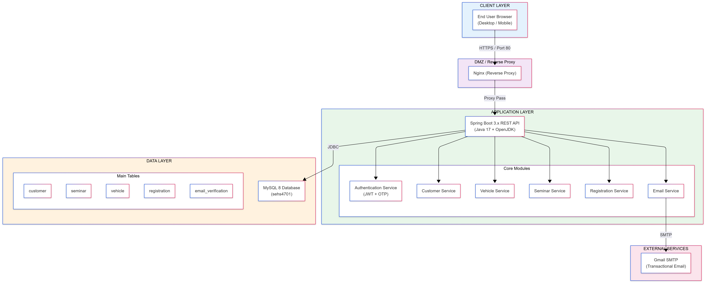

**Component responsibilities:**

| Component | Responsibility |
|---|---|
| React SPA | Renders all UI pages; manages client-side routing; stores JWT in `localStorage`; injects Bearer token on all API requests |
| Nginx | Serves compiled SPA static assets; proxies `/api/**` requests to the Spring Boot backend |
| Spring Security Filter Chain | Intercepts all requests; validates JWT; populates `SecurityContext`; rejects unauthenticated requests with HTTP 401 |
| Controller Layer | Receives HTTP requests; delegates to service layer; returns JSON responses |
| Service Layer | Implements all business logic; enforces business rules; coordinates repository and email operations |
| Repository Layer | Provides JPA-based data access; executes JPQL/native queries against MySQL |
| MySQL 8 | Persists all application data; enforces referential integrity and constraints |
| Gmail SMTP | Delivers transactional emails (OTP, confirmations, notifications) |

---

### 5.2 Physical System Diagram

In the containerised deployment, all three application tiers run as Docker containers orchestrated by Docker Compose on a single host machine:

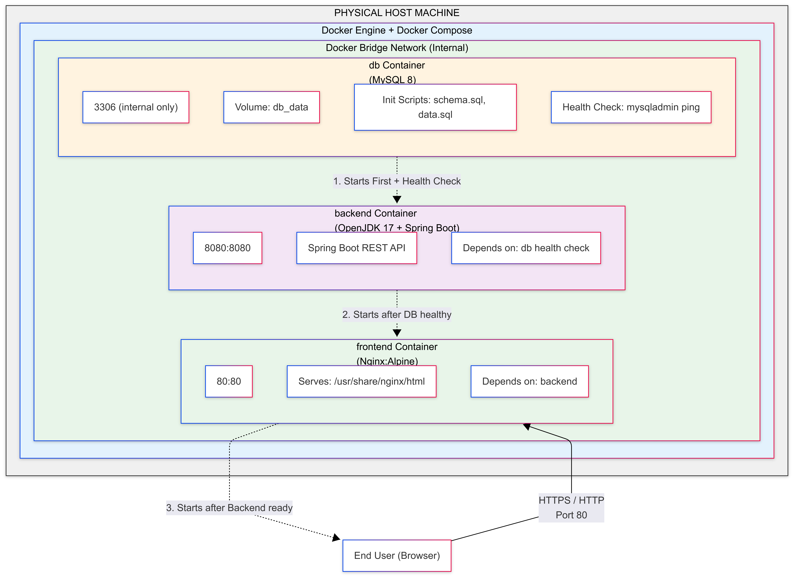

**Container startup order:**
1. `db` container starts and passes MySQL health check (`mysqladmin ping`)
2. `backend` container starts (depends on `db` health check passing)
3. `frontend` container starts (depends on `backend` being up)

**Network topology:**
- All containers share a Docker bridge network; inter-container communication uses service names as hostnames (e.g., `backend:8080`, `db:3306`)
- Only ports `80` (frontend) and `8080` (backend) are exposed to the host; the database port `3306` is internal only

---

### 5.3 Overall System Flowchart

The following describes the holistic data and control flow across the major system processes:

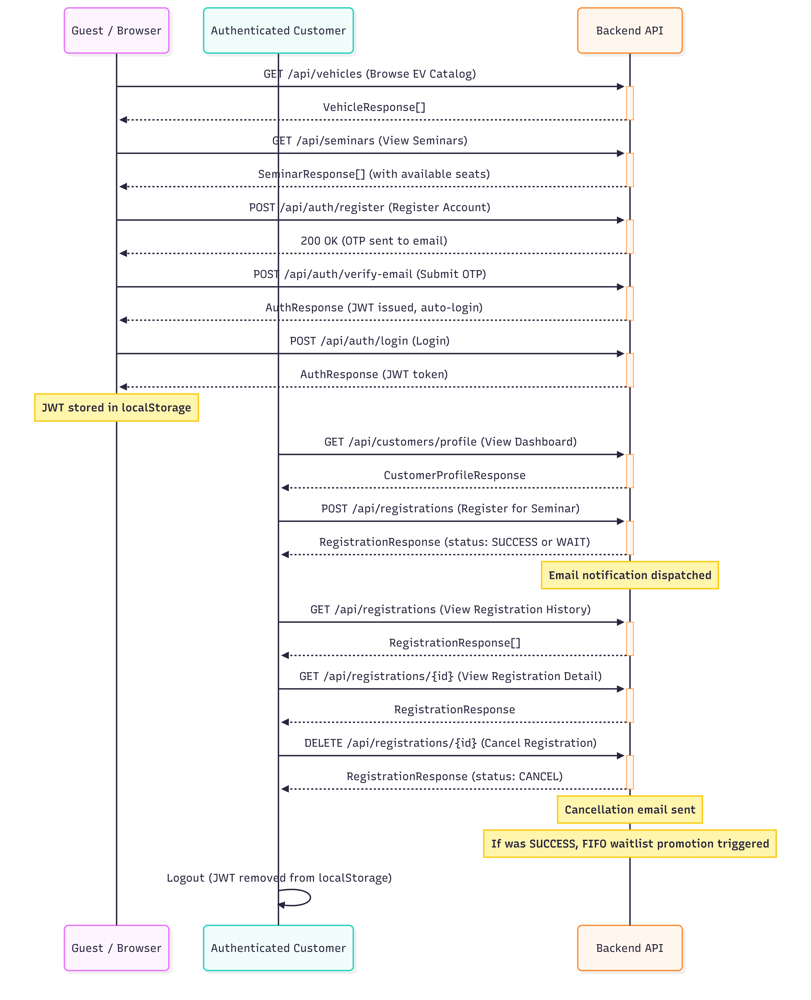


For Further Information, please refer to [`docs/EV Seminar Registration System Process Flow List.xlsx`](docs/EV%20Seminar%20Registration%20System%20Process%20Flow%20List.xlsx) and [`UI, Documents, Reports, Task and Database Lists.xlsx`](docs/UI,%20Documents,%20Reports,%20Task%20and%20Database%20Lists.xlsx).

The process flow charts for individual functions are available in [`docs/Process Flow Charts.drawio.png`](docs/Process%20Flow%20Charts.drawio.png).

---

### 5.4 Comprehensive ER Diagram

The following describes the complete entity-relationship model of the `sehs4701` database schema. The visual ER diagram is available at [`docs/Relationship_Page.drawio.png`](docs/Relationship_Page.drawio.png).

#### 5.4.1 Entity Summary

| Entity | Table | Primary Key | Description |
|---|---|---|---|
| Customer | `customer` | `id` (BIGINT, AUTO_INCREMENT) | Registered customer account |
| EmailVerification | `email_verification` | `id` (BIGINT, AUTO_INCREMENT) | OTP records for email verification |
| EmailLog | `email_log` | `id` (BIGINT, AUTO_INCREMENT) | Audit log of all dispatched emails |
| Vehicle | `vehicle` | `id` (BIGINT, AUTO_INCREMENT) | EV model in the catalog |
| Seminar | `seminar` | `id` (BIGINT, AUTO_INCREMENT) | Scheduled seminar event |
| Registration | `registration` | `id` (BIGINT, AUTO_INCREMENT) | Customer booking for a seminar |

#### 5.4.2 Relationships

| Relationship | Type | Foreign Key | Description |
|---|---|---|---|
| Customer → EmailVerification | One-to-Many | `email_verification.customer_id → customer.id` | A customer may have multiple OTP records (one per registration attempt) |
| Customer → Registration | One-to-Many | `registration.customer_id → customer.id` | A customer may have multiple seminar registrations |
| Vehicle → Seminar | One-to-Many | `seminar.vehicle_id → vehicle.id` | A vehicle may be featured in multiple seminars |
| Seminar → Registration | One-to-Many | `registration.seminar_id → seminar.id` | A seminar may have multiple registrations |

#### 5.4.3 Entity Attribute Detail

**`customer`**

| Column | Type | Constraints | Description |
|---|---|---|---|
| `id` | BIGINT | PK, AUTO_INCREMENT | Surrogate primary key |
| `name` | VARCHAR(100) | NOT NULL | Customer full name |
| `telephone` | VARCHAR(20) | NOT NULL | Contact telephone number |
| `email` | VARCHAR(255) | NOT NULL, UNIQUE | Login identifier; normalised to lowercase |
| `password_hash` | VARCHAR(255) | NOT NULL | BCrypt-hashed password |
| `customer_type` | ENUM('COMPANY','PERSONAL') | NOT NULL | Customer classification |
| `email_verified` | BOOLEAN | DEFAULT FALSE | Account activation flag |
| `created_at` | TIMESTAMP | DEFAULT CURRENT_TIMESTAMP | Record creation time |
| `updated_at` | TIMESTAMP | ON UPDATE CURRENT_TIMESTAMP | Last modification time |

**`email_verification`**

| Column | Type | Constraints | Description |
|---|---|---|---|
| `id` | BIGINT | PK, AUTO_INCREMENT | Surrogate primary key |
| `customer_id` | BIGINT | NOT NULL, FK → customer.id | Owning customer |
| `otp_code` | VARCHAR(6) | NOT NULL | 6-digit OTP value |
| `expires_at` | TIMESTAMP | NOT NULL | OTP expiry time (10 minutes from creation) |
| `verified` | BOOLEAN | DEFAULT FALSE | Whether this OTP was successfully used |
| `created_at` | TIMESTAMP | DEFAULT CURRENT_TIMESTAMP | Record creation time |

**`email_log`**

| Column | Type | Constraints | Description |
|---|---|---|---|
| `id` | BIGINT | PK, AUTO_INCREMENT | Surrogate primary key |
| `recipient` | VARCHAR(255) | NOT NULL | Recipient email address |
| `email_type` | VARCHAR(50) | NOT NULL | Email category (e.g., OTP, CONFIRMATION) |
| `subject` | VARCHAR(200) | NOT NULL | Email subject line |
| `body` | TEXT | — | Email body content |
| `status` | VARCHAR(20) | NOT NULL | Dispatch status (e.g., SENT, FAILED) |
| `error_message` | TEXT | — | Error detail if dispatch failed |
| `sent_at` | TIMESTAMP | NULL | Actual dispatch timestamp |
| `created_at` | TIMESTAMP | DEFAULT CURRENT_TIMESTAMP | Record creation time |

**`vehicle`**

| Column | Type | Constraints | Description |
|---|---|---|---|
| `id` | BIGINT | PK, AUTO_INCREMENT | Surrogate primary key |
| `model_number` | VARCHAR(50) | NOT NULL, UNIQUE | EV model identifier |
| `description` | TEXT | — | Model description |
| `picture_url` | VARCHAR(500) | — | URL to model image |
| `features` | TEXT | — | Feature list |
| `unit_price` | DECIMAL(12,2) | NOT NULL | Retail price |
| `created_at` | TIMESTAMP | DEFAULT CURRENT_TIMESTAMP | Record creation time |

**`seminar`**

| Column | Type | Constraints | Description |
|---|---|---|---|
| `id` | BIGINT | PK, AUTO_INCREMENT | Surrogate primary key |
| `vehicle_id` | BIGINT | NOT NULL, FK → vehicle.id | Featured EV model |
| `seminar_date` | DATETIME | NOT NULL | Scheduled date and time |
| `max_seats` | INT | NOT NULL | Total seat capacity |
| `created_at` | TIMESTAMP | DEFAULT CURRENT_TIMESTAMP | Record creation time |

**`registration`**

| Column | Type | Constraints | Description |
|---|---|---|---|
| `id` | BIGINT | PK, AUTO_INCREMENT | Surrogate primary key |
| `customer_id` | BIGINT | NOT NULL, FK → customer.id | Registering customer |
| `seminar_id` | BIGINT | NOT NULL, FK → seminar.id | Target seminar |
| `seats_booked` | INT | NOT NULL, CHECK (1–2) | Number of seats requested |
| `status` | ENUM('SUCCESS','WAIT','CANCEL') | NOT NULL | Registration status |
| `created_at` | TIMESTAMP | DEFAULT CURRENT_TIMESTAMP | Record creation time (used for FIFO ordering) |
| `updated_at` | TIMESTAMP | ON UPDATE CURRENT_TIMESTAMP | Last status change time |

#### 5.4.4 Database Indexes

| Index Name | Table | Column(s) | Purpose |
|---|---|---|---|
| `idx_customer_email` | `customer` | `email` | Fast customer lookup by email (login, auth) |
| `idx_seminar_date` | `seminar` | `seminar_date` | Fast seminar filtering by date |
| `idx_registration_customer` | `registration` | `customer_id` | Fast registration history retrieval |
| `idx_registration_seminar` | `registration` | `seminar_id` | Fast seat count aggregation per seminar |
| `idx_registration_status` | `registration` | `status` | Fast filtering by registration status |
| `idx_email_log_recipient` | `email_log` | `recipient` | Fast email log lookup by recipient |
| `idx_email_log_type` | `email_log` | `email_type` | Fast email log filtering by type |

---

## 6. System Functions (Functional Requirements)

Each system function is documented with the following subsections: **Description**, **Function Implementation**, **Validation**, and **Data Dictionary**. All functions are derived directly from the implemented source code and database schema.

---

### 6.1 User Registration (SF-001)

#### Description

SF-001 enables a new visitor to create a customer account in the ZhongNeng EV Seminar Registration System. The customer provides their personal details and selects an account type (`PERSONAL` or `COMPANY`). Upon successful submission, the system creates an unverified account record, generates a 6-digit OTP, and dispatches a verification email. The account remains inactive until email verification (SF-002) is completed.

- **Function ID:** SF-001
- **Endpoint:** `POST /api/auth/register`
- **Access:** Public (no authentication required)
- **Frontend Page:** [`RegisterPage.jsx`](frontend/electric-vehicle-seminar-ui/src/pages/RegisterPage.jsx) at route `/register`
- **Related Business Rules:** BR-001, BR-002, BR-003, BR-004, BR-005, BR-006, BR-007, BR-008, BR-013

---

#### Function Implementation

**Step-by-step process:**

1. The customer navigates to `/register` and completes the registration form with: full name, telephone number, email address, password, password confirmation, and customer type (`PERSONAL` or `COMPANY`).
2. The frontend performs client-side pre-validation:
   - Checks that `password` matches `confirmPassword`.
   - Checks that `password.length >= 6`.
   - Normalises the email to lowercase and trims whitespace.
3. On form submission, the frontend calls `POST /api/auth/register` via [`authService.js`](frontend/electric-vehicle-seminar-ui/src/api/authService.js) with the payload: `{ name, telephone, email, password, customerType }`.
4. The [`AuthController`](backend/src/main/java/com/sehs4701/backend/controller/AuthController.java) receives the request and delegates to [`AuthService.register()`](backend/src/main/java/com/sehs4701/backend/service/AuthService.java).
5. [`AuthService`](backend/src/main/java/com/sehs4701/backend/service/AuthService.java) normalises the email (lowercase + trim) and checks whether a customer record already exists for that email:
   - **Email already registered and verified** → throws `BadRequestException`: *"Email already registered and verified. Please login."*
   - **Email exists but unverified** → updates the existing customer record with the new submission details and resets `email_verified = false`. A new OTP is generated and the previous OTP is superseded.
   - **New email** → creates a new `Customer` entity with `email_verified = false` and persists it.
6. A 6-digit OTP is generated using `SecureRandom` (range 100000–999999) and an `EmailVerification` record is created with `expires_at = now() + 10 minutes`.
7. The system attempts to dispatch the OTP verification email via [`EmailService`](backend/src/main/java/com/sehs4701/backend/service/EmailService.java):
   - **Email sent successfully** → returns HTTP 200 with message: *"Registration successful. Please check your email for the verification code."*
   - **Email dispatch fails** → the OTP record is still persisted; returns HTTP 200 with degraded-mode message advising retrieval from the database.
8. The frontend stores the normalised email in `localStorage` as `pendingEmail` and navigates to `/verify` to await OTP entry (SF-002).

**Sequence:**

---

#### Validation

| Field | Rule | Error Message |
|---|---|---|
| `name` | Not blank; max 100 characters | *"Name is required"* / *"size must be between 0 and 100"* |
| `telephone` | Not blank; max 20 characters | *"Telephone is required"* / *"size must be between 0 and 20"* |
| `email` | Not blank; valid RFC email format | *"Email is required"* / *"Invalid email format"* |
| `password` | Not blank; min 6 characters | *"Password is required"* / *"Password must be at least 6 characters"* |
| `confirmPassword` | Must match `password` (client-side only) | *"Passwords do not match."* |
| `customerType` | Not null; must be `PERSONAL` or `COMPANY` | *"Customer type is required"* |
| Email uniqueness | Email must not already be registered and verified | *"Email already registered and verified. Please login."* |

Validation errors from Bean Validation (JSR-380) are returned as HTTP 400 with the [`ApiErrorResponse`](backend/src/main/java/com/sehs4701/backend/dto/response/ApiErrorResponse.java) structure:

```json
{
  "status": 400,
  "message": "Validation failed",
  "errors": ["email: Invalid email format", "password: Password must be at least 6 characters"],
  "timestamp": "2026-04-26T12:00:00"
}
```

---

#### Data Dictionary

**Tables affected:** `customer`, `email_verification`

**`customer` — INSERT or UPDATE**

| Column | Operation | Value |
|---|---|---|
| `name` | Write | Trimmed value from `RegisterRequest.name` |
| `telephone` | Write | Trimmed value from `RegisterRequest.telephone` |
| `email` | Write | Normalised (lowercase + trimmed) email |
| `password_hash` | Write | BCrypt hash of `RegisterRequest.password` |
| `customer_type` | Write | `PERSONAL` or `COMPANY` from `RegisterRequest.customerType` |
| `email_verified` | Write | `false` (always set to false on registration) |
| `created_at` | Auto | Set by `@CreationTimestamp` on first insert |
| `updated_at` | Auto | Set by `@UpdateTimestamp` on every save |

**`email_verification` — INSERT**

| Column | Operation | Value |
|---|---|---|
| `customer_id` | Write | FK to the saved `customer.id` |
| `otp_code` | Write | 6-digit string generated by `SecureRandom` (100000–999999) |
| `expires_at` | Write | `LocalDateTime.now().plusMinutes(10)` |
| `verified` | Write | `false` |
| `created_at` | Auto | Set by database `DEFAULT CURRENT_TIMESTAMP` |

**Entity Relationship (local):**

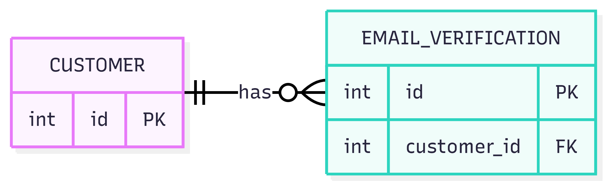

---

### 6.2 Email OTP Verification (SF-002)

#### Description

SF-002 enables a newly registered customer to verify their email address by submitting the 6-digit OTP that was dispatched during SF-001. Upon successful verification, the customer's account is activated (`email_verified = true`), a JWT is immediately issued (auto-login), and a registration success email is dispatched. The customer is then redirected to their dashboard without requiring a separate login step.

- **Function ID:** SF-002
- **Endpoint:** `POST /api/auth/verify-email`
- **Access:** Public (no authentication required)
- **Frontend Page:** [`VerificationPage.jsx`](frontend/electric-vehicle-seminar-ui/src/pages/VerificationPage.jsx) at route `/verify`
- **Related Business Rules:** BR-006, BR-009, BR-010, BR-011, BR-012

---

#### Function Implementation

**Step-by-step process:**

1. After completing SF-001, the frontend navigates to `/verify` and passes the normalised email via React Router `location.state`. If `location.state` is absent, the email is retrieved from `localStorage` key `pendingEmail`. If neither is available, the user is redirected back to `/register`.
2. The customer enters the 6-digit OTP received in their email into the verification form.
3. The frontend performs client-side pre-validation: the OTP must match the pattern `^\d{6}$` (exactly 6 numeric digits). If not, an error is displayed without making an API call.
4. On form submission, the frontend calls `POST /api/auth/verify-email` via [`authService.js`](frontend/electric-vehicle-seminar-ui/src/api/authService.js) with payload: `{ email, otpCode }`.
5. The [`AuthController`](backend/src/main/java/com/sehs4701/backend/controller/AuthController.java) receives the request and delegates to [`AuthService.verifyEmail()`](backend/src/main/java/com/sehs4701/backend/service/AuthService.java).
6. [`AuthService`](backend/src/main/java/com/sehs4701/backend/service/AuthService.java) normalises the email and looks up the customer record:
   - **Customer not found** → throws `ResourceNotFoundException`.
   - **Email already verified** → throws `BadRequestException`: *"Email already verified."*
7. The most recent `EmailVerification` record for the customer is retrieved (`findTopByCustomerIdOrderByCreatedAtDesc`):
   - **No verification record found** → throws `BadRequestException`: *"No verification code found. Please register again."*
   - **OTP expired** (`expires_at` before `now()`) → throws `BadRequestException`: *"Verification code has expired. Please register again."*
   - **OTP mismatch** → throws `BadRequestException`: *"Invalid verification code."*
8. On successful OTP match:
   - `email_verification.verified` is set to `true`.
   - `customer.email_verified` is set to `true`.
   - A registration success email is dispatched via [`EmailService`](backend/src/main/java/com/sehs4701/backend/service/EmailService.java).
   - A JWT is generated via [`JwtUtil.generateToken(email)`](backend/src/main/java/com/sehs4701/backend/security/JwtUtil.java) and returned in the [`AuthResponse`](backend/src/main/java/com/sehs4701/backend/dto/response/AuthResponse.java).
9. The frontend receives the `AuthResponse`, calls `login()` from [`AuthContext`](frontend/electric-vehicle-seminar-ui/src/context/AuthContext.jsx) to store the JWT and user details, displays a success message, and navigates to `/dashboard` after a 700 ms delay.

**Sequence:**

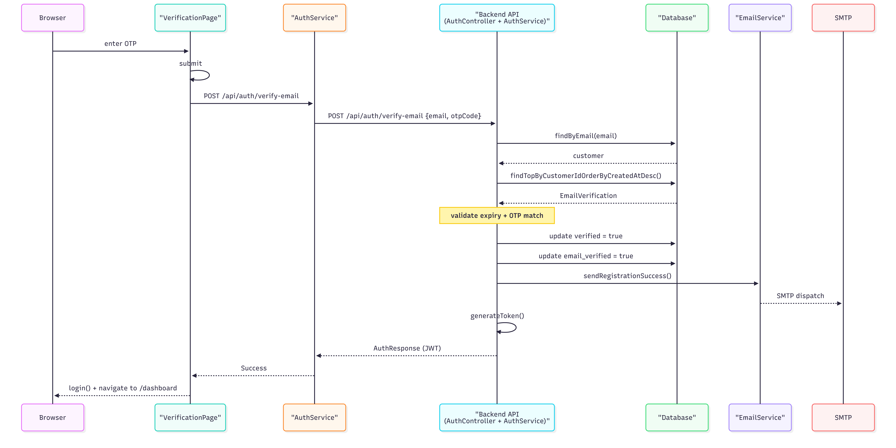


---

#### Validation

| Field | Rule | Error Message |
|---|---|---|
| `email` | Not blank; valid RFC email format | *"Email is required"* / *"must be a well-formed email address"* |
| `otpCode` | Not blank; exactly 6 characters | *"OTP code is required"* / *"OTP must be 6 digits"* |
| OTP format (client-side) | Must match `^\d{6}$` | *"Please enter the 6-digit OTP code sent to your email."* |
| Customer existence | Customer must exist for the given email | HTTP 404 `ResourceNotFoundException` |
| Already verified | Account must not already be verified | *"Email already verified."* |
| OTP record existence | A verification record must exist | *"No verification code found. Please register again."* |
| OTP expiry | `expires_at` must be after `now()` | *"Verification code has expired. Please register again."* |
| OTP correctness | Submitted `otpCode` must match stored `otp_code` | *"Invalid verification code."* |

---

#### Data Dictionary

**Tables affected:** `customer` (UPDATE), `email_verification` (UPDATE)

**`email_verification` — UPDATE**

| Column | Operation | Value |
|---|---|---|
| `verified` | Write | `true` (set on successful OTP match) |

**`customer` — UPDATE**

| Column | Operation | Value |
|---|---|---|
| `email_verified` | Write | `true` (set on successful OTP match) |
| `updated_at` | Auto | Updated by `@UpdateTimestamp` |

**Response payload — [`AuthResponse`](backend/src/main/java/com/sehs4701/backend/dto/response/AuthResponse.java)**

| Field | Type | Description |
|---|---|---|
| `token` | String | JWT Bearer token (24-hour expiry) |
| `email` | String | Normalised customer email address |
| `name` | String | Customer full name |
| `verified` | Boolean | `true` — account is now verified |

**Entity Relationship (local):**


---

### 6.3 User Login (SF-003)

#### Description

SF-003 allows a registered and verified customer to sign into the system. The customer provides their email and password. Upon successful authentication, the system issues a JSON Web Token (JWT) with a 24-hour expiry, which is used to secure subsequent API requests. Unverified customers are denied access.

- **Function ID:** SF-003
- **Endpoint:** `POST /api/auth/login`
- **Access:** Public (no authentication required)
- **Frontend Page:** [`LoginPage.jsx`](frontend/electric-vehicle-seminar-ui/src/pages/LoginPage.jsx) at route `/login`
- **Related Business Rules:** BR-006, BR-034, BR-035, BR-036, BR-037

---

#### Function Implementation

**Step-by-step process:**

1.  The customer navigates to `/login` and enters their email address and password.
2.  The frontend performs client-side pre-validation: email and password fields must not be empty.
3.  On form submission, the frontend calls `POST /api/auth/login` via [`authService.js`](frontend/electric-vehicle-seminar-ui/src/api/authService.js) with the payload: `{ email, password }`.
4.  The [`AuthController`](backend/src/main/java/com/sehs4701/backend/controller/AuthController.java) receives the request and delegates to [`AuthService.login()`](backend/src/main/java/com/sehs4701/backend/service/AuthService.java).
5.  [`AuthService`](backend/src/main/java/com/sehs4701/backend/service/AuthService.java) normalises the email (lowercase + trim) and looks up the customer by email.
    -   **Customer not found** → throws `UnauthorizedException`: *"Invalid credentials"* to prevent user enumeration.
6.  The service checks if the customer's email has been verified (`customer.isEmailVerified()`).
    -   **Email not verified** → throws `UnauthorizedException`: *"Email not verified. Please complete the verification process."*
7.  The provided plaintext password from the `LoginRequest` is compared against the stored `password_hash` using Spring Security's `PasswordEncoder.matches()`.
    -   **Password mismatch** → throws `UnauthorizedException`: *"Invalid credentials"*.
8.  On successful password match, a JWT is generated via [`JwtUtil.generateToken(email)`](backend/src/main/java/com/sehs4701/backend/security/JwtUtil.java). The token is valid for 24 hours.
9.  The service returns an [`AuthResponse`](backend/src/main/java/com/sehs4701/backend/dto/response/AuthResponse.java) DTO containing the JWT, customer email, name, and verification status (`true`).
10. The frontend receives the `AuthResponse`, calls the `login()` method from [`AuthContext`](frontend/electric-vehicle-seminar-ui/src/context/AuthContext.jsx) to store the token and user details in `localStorage`, and navigates the user to the `/dashboard`.

**Sequence:**

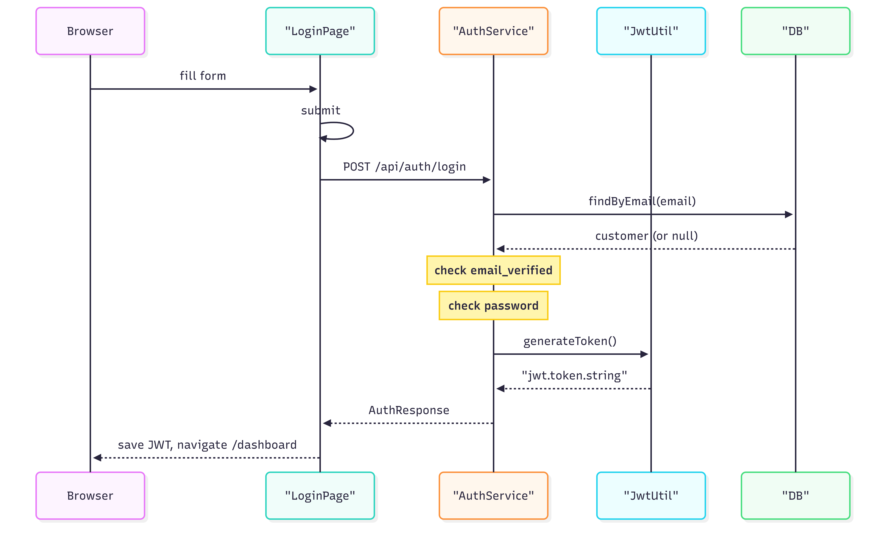

---

#### Validation

| Field | Rule | Error Message |
|---|---|---|
| `email` | Not blank; valid RFC email format | *"Email is required"* / *"Invalid email format"* |
| `password` | Not blank | *"Password is required"* |
| Customer Existence | Customer must exist for the given email | *"Invalid credentials"* |
| Email Verification | `customer.email_verified` must be `true` | *"Email not verified. Please complete the verification process."* |
| Password Match | Submitted password must match the stored hash | *"Invalid credentials"* |

Validation errors from the DTO are returned as HTTP 400. Authentication failures (`UnauthorizedException`) are returned as HTTP 401.

```json
{
  "status": 401,
  "message": "Invalid credentials",
  "errors": [],
  "timestamp": "2026-04-26T12:05:00"
}
```

---

#### Data Dictionary

**Tables affected:** `customer` (Read-only)

**`customer` — READ**

| Column | Operation | Purpose |
|---|---|---|
| `email` | Read | Find the customer record based on the login request. |
| `password_hash` | Read | Compare against the provided password. |
| `email_verified` | Read | Ensure the account is active before allowing login. |
| `name` | Read | Populate the `AuthResponse` DTO. |

**Response payload — [`AuthResponse`](backend/src/main/java/com/sehs4701/backend/dto/response/AuthResponse.java)**

| Field | Type | Description |
|---|---|---|
| `token` | String | JWT Bearer token with a 24-hour expiry. |
| `email` | String | Normalised customer email address. |
| `name` | String | Customer's full name. |
| `verified` | Boolean | Always `true` on successful login. |

**Entity Relationship (local):** None. This is a read-only operation that produces a transient JWT.

---

### 6.4 User Logout (SF-004)

#### Description

SF-004 allows an authenticated customer to sign out of the system. The logout process is handled entirely on the client-side. It invalidates the current session by removing the JWT and user information from the browser's `localStorage`, then redirects the user to the home page. As the backend is stateless, no API call is made to a logout endpoint.

- **Function ID:** SF-004
- **Endpoint:** None (Client-side operation)
- **Access:** Authenticated
- **Frontend Page:** The logout button is located in the [`Navbar.jsx`](frontend/electric-vehicle-seminar-ui/src/components/layout/Navbar.jsx) component, visible on all pages to an authenticated user.
- **Related Business Rules:** BR-038

---

#### Function Implementation

**Step-by-step process:**

1.  The authenticated customer clicks the "Logout" button in the main navigation bar.
2.  The `onClick` event triggers the `handleLogout()` function within the [`Navbar.jsx`](frontend/electric-vehicle-seminar-ui/src/components/layout/Navbar.jsx) component.
3.  `handleLogout()` calls the `logout()` function provided by the `useAuth()` hook, which comes from [`AuthContext.jsx`](frontend/electric-vehicle-seminar-ui/src/context/AuthContext.jsx).
4.  The `logout()` function performs the following actions:
    -   Sets the global `user` state to `null`.
    -   Removes the `"user"` item from the browser's `localStorage`.
    -   Removes the `"token"` item (the JWT) from `localStorage`.
    -   Removes the `"pendingEmail"` item from `localStorage` as a cleanup measure.
5.  After the `logout()` function completes, the `handleLogout()` function in the `Navbar` uses React Router's `navigate()` function to redirect the user to the home page (`/`) with `replace: true`, preventing the user from navigating back to the previous authenticated page.
6.  The UI automatically re-renders to its unauthenticated state, showing the "Sign in" and "Get started" buttons instead of the user dashboard and logout buttons.

**Sequence:**

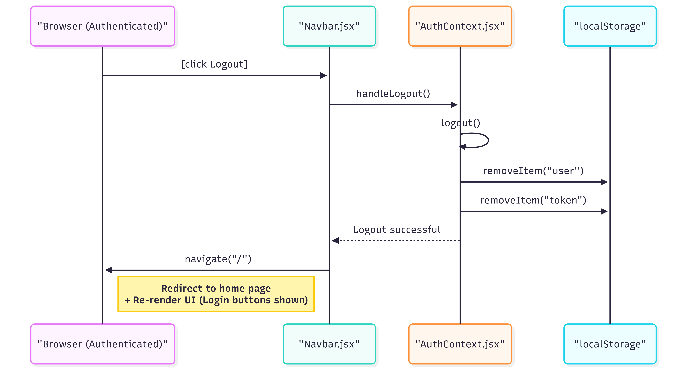

---

#### Validation

This function does not involve any server-side validation as it is a purely client-side operation. The only prerequisite is that the user must be authenticated for the "Logout" button to be visible. There are no specific error messages associated with this flow.

---

#### Data Dictionary

**Tables affected:** None. This is a stateless, client-side operation that does not interact with the database.

**`localStorage` affected:**

| Key | Operation | Description |
|---|---|---|
| `user` | Remove | Deletes the stored JSON string of the authenticated user's details. |
| `token` | Remove | Deletes the stored JWT, effectively ending the session. |
| `pendingEmail` | Remove | Deletes any stored email from a previous registration attempt. |

**Entity Relationship (local):** None.

---

### 6.5 User Dashboard and Profile (SF-005)

#### Description

SF-005 provides an authenticated customer with a personalized dashboard that serves as their main landing page after login. This function retrieves and displays the customer's profile information, a summary of their registration statistics, and a list of their most recent seminar bookings. The dashboard also provides quick links to other key areas of the application.

- **Function ID:** SF-005
- **Endpoint:** `GET /api/users/profile`
- **Access:** Authenticated
- **Frontend Page:** [`DashboardPage.jsx`](frontend/electric-vehicle-seminar-ui/src/pages/DashboardPage.jsx) at route `/dashboard`
- **Related Business Rules:** BR-031, BR-037

---

#### Function Implementation

**Step-by-step process:**

1.  The authenticated customer navigates to the `/dashboard` route, typically after logging in or by clicking the "Dashboard" button in the navigation bar.
2.  The [`DashboardPage.jsx`](frontend/electric-vehicle-seminar-ui/src/pages/DashboardPage.jsx) component mounts and triggers a `useEffect` hook to fetch all necessary data.
3.  The frontend makes a `GET` request to `/api/users/profile` via the `customerService.getCustomerProfile()` function in [`customerService.js`](frontend/electric-vehicle-seminar-ui/src/api/customerService.js). The request automatically includes the JWT Bearer token from `localStorage`.
4.  The backend's [`JwtAuthenticationFilter`](backend/src/main/java/com/sehs4701/backend/security/JwtAuthenticationFilter.java) validates the token and extracts the user's email from the subject claim, populating the `SecurityContext`.
5.  The [`CustomerController`](backend/src/main/java/com/sehs4701/backend/controller/CustomerController.java) receives the request. The `@AuthenticationPrincipal` annotation injects the `UserDetails` object, from which the email (username) is retrieved.
6.  The controller calls [`CustomerService.getProfile()`](backend/src/main/java/com/sehs4701/backend/service/CustomerService.java) with the customer's email.
7.  The service layer fetches the `Customer` entity from the database using `customerRepository.findByEmail()`.
    -   If the customer is not found (e.g., token is valid but user was deleted), it throws a `ResourceNotFoundException`.
8.  The service maps the `Customer` entity to a [`CustomerProfileResponse`](backend/src/main/java/com/sehs4701/backend/dto/response/CustomerProfileResponse.java) DTO and returns it to the controller.
9.  The controller sends the DTO back to the frontend as a JSON payload with an HTTP 200 OK status.
10. The frontend receives the profile data and stores it in the `profile` state variable, causing the component to re-render and display the customer's details in the "Profile" card.

**Sequence:**

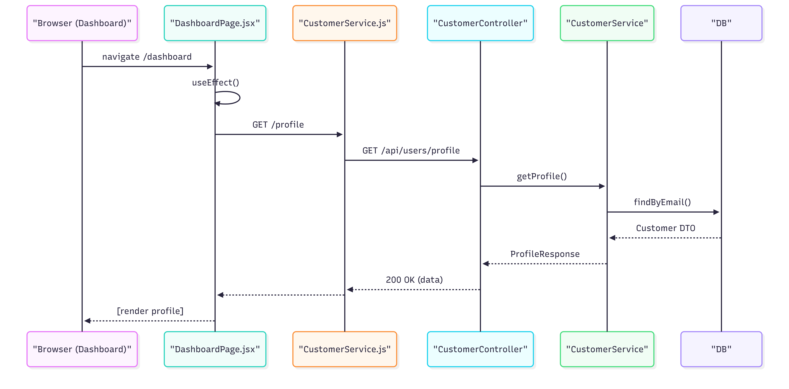

---

#### Validation

| Concern | Rule | Error Message |
|---|---|---|
| Authentication | A valid JWT must be provided in the `Authorization` header. | HTTP 401 Unauthorized (Handled by [`JwtAuthenticationEntryPoint`](backend/src/main/java/com/sehs4701/backend/security/JwtAuthenticationEntryPoint.java)) |
| User Existence | The user identified by the JWT's subject claim must exist in the database. | HTTP 404 Not Found with message: *"Customer not found"* |

---

#### Data Dictionary

**Tables affected:** `customer` (Read-only)

**`customer` — READ**

| Column | Operation | Purpose |
|---|---|---|
| `id` | Read | To populate the `id` field in the response. |
| `name` | Read | To populate the `name` field in the response. |
| `telephone` | Read | To populate the `telephone` field in the response. |
| `email` | Read | To populate the `email` field in the response. |
| `customer_type` | Read | To populate the `customerType` field in the response. |
| `email_verified` | Read | To populate the `emailVerified` flag in the response. |
| `created_at` | Read | To populate the `createdAt` timestamp in the response. |

**Response payload — [`CustomerProfileResponse`](backend/src/main/java/com/sehs4701/backend/dto/response/CustomerProfileResponse.java)**

| Field | Type | Description |
|---|---|---|
| `id` | Long | The unique identifier of the customer. |
| `name` | String | The customer's full name. |
| `telephone` | String | The customer's contact telephone number. |
| `email` | String | The customer's unique email address. |
| `customerType` | Enum | `PERSONAL` or `COMPANY`. |
| `emailVerified` | boolean | `true` if the customer's email is verified, otherwise `false`. |
| `createdAt` | LocalDateTime | The timestamp when the customer account was created. |

**Entity Relationship (local):** None. This is a read-only operation on a single entity.

---

### 6.6 EV Catalog Browsing (SF-006)

#### Description

SF-006 allows any visitor (authenticated or unauthenticated) to browse the catalog of electric vehicles offered by ZhongNeng. The system fetches and displays a list of all available vehicle models, including their model number, description, features, price, and an image. For each vehicle, the page also shows details of the next upcoming seminar associated with it, if any.

- **Function ID:** SF-006
- **Endpoint:** `GET /api/vehicles`
- **Access:** Public
- **Frontend Page:** [`EVCatalogPage.jsx`](frontend/electric-vehicle-seminar-ui/src/pages/EVCatalogPage.jsx) at route `/ev-catalog`
- **Related Business Rules:** None

---

#### Function Implementation

**Step-by-step process:**

1.  A user navigates to the `/ev-catalog` route.
2.  The [`EVCatalogPage.jsx`](frontend/electric-vehicle-seminar-ui/src/pages/EVCatalogPage.jsx) component mounts and its `useEffect` hook initiates data fetching.
3.  The frontend makes two parallel API calls using `Promise.all`:
    -   A `GET` request to `/api/vehicles` via `vehicleService.getVehicles()`.
    -   A `GET` request to `/api/seminars` via `seminarService.getUpcomingSeminars()` to enrich the vehicle cards with seminar data.
4.  The backend's [`VehicleController`](backend/src/main/java/com/sehs4701/backend/controller/VehicleController.java) handles the `/api/vehicles` request and calls [`VehicleService.getAllVehicles()`](backend/src/main/java/com/sehs4701/backend/service/VehicleService.java).
5.  The service layer retrieves all `Vehicle` entities from the database using `vehicleRepository.findAll()`.
6.  Each `Vehicle` entity is mapped to a [`VehicleResponse`](backend/src/main/java/com/sehs4701/backend/dto/response/VehicleResponse.java) DTO.
7.  The service returns a list of `VehicleResponse` DTOs to the controller, which sends it to the frontend as a JSON array with an HTTP 200 OK status.
8.  The frontend receives the vehicle and seminar data, storing them in their respective state variables (`vehicles` and `seminars`).
9.  The component renders a grid of "vehicle cards". For each vehicle, it displays its details and looks up the next associated seminar from the `seminars` state to show its date and seat availability.
10. A "Register seminar" button on each card links the user to the main seminar registration page (`/seminars`).

**Sequence:**

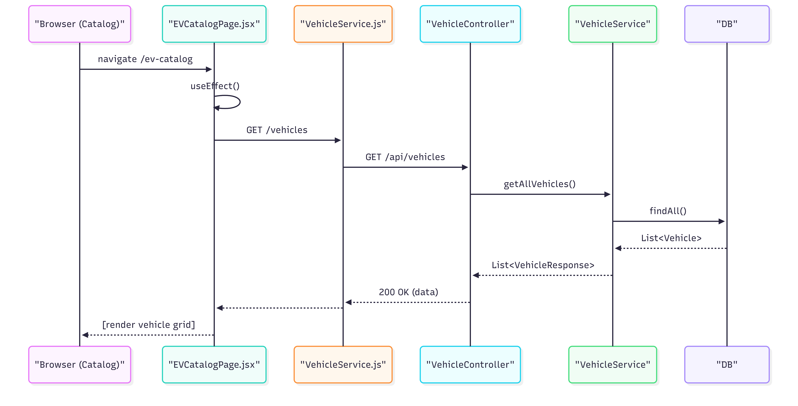

---

#### Validation

This function is a public, read-only operation and has no specific validation rules. If the backend API call fails for any reason (e.g., server error, network issue), the frontend will display a generic error message: *"Failed to load vehicle information. Please try again."*

If a vehicle record is retrieved successfully but its `pictureUrl` is invalid or fails to load, the frontend will substitute a fallback image from `picsum.photos` to prevent broken image icons.

---

#### Data Dictionary

**Tables affected:** `vehicle` (Read-only)

**`vehicle` — READ**

| Column | Operation | Purpose |
|---|---|---|
| `id` | Read | Unique identifier for the vehicle and for keying in React. |
| `model_number` | Read | To display the vehicle's model name. |
| `description` | Read | To display the vehicle's descriptive text. |
| `picture_url` | Read | To display the vehicle's image. |
| `features` | Read | To list the key features of the vehicle. |
| `unit_price` | Read | To display the vehicle's price. |

**Response payload — `List<VehicleResponse>`**

Each item in the list is a [`VehicleResponse`](backend/src/main/java/com/sehs4701/backend/dto/response/VehicleResponse.java) object:

| Field | Type | Description |
|---|---|---|
| `id` | Long | The unique identifier of the vehicle. |
| `modelNumber` | String | The model number/name of the vehicle. |
| `description` | String | A short description of the vehicle. |
| `pictureUrl` | String | URL for the vehicle's image. |
| `features` | String | A comma-separated string of vehicle features. |
| `unitPrice` | BigDecimal | The retail price of the vehicle. |

**Entity Relationship (local):** None. This is a read-only operation on a single entity type.

---

### 6.7 Upcoming Seminar Listing (SF-007)

#### Description

SF-007 provides a publicly accessible list of all upcoming seminars. The system fetches seminars scheduled for a future date and displays them in chronological order. For each seminar, it calculates and shows the real-time seat availability by subtracting the number of confirmed (`SUCCESS`) bookings from the seminar's maximum capacity. This allows users to see which seminars have open seats and which are on a waitlist basis.

- **Function ID:** SF-007
- **Endpoint:** `GET /api/seminars/upcoming`
- **Access:** Public
- **Frontend Page:** [`SeminarRegistrationPage.jsx`](frontend/electric-vehicle-seminar-ui/src/pages/SeminarRegistrationPage.jsx) at route `/seminars`
- **Related Business Rules:** BR-018

---

#### Function Implementation

**Step-by-step process:**

1.  A user navigates to the `/seminars` route.
2.  The [`SeminarRegistrationPage.jsx`](frontend/electric-vehicle-seminar-ui/src/pages/SeminarRegistrationPage.jsx) component mounts and its `useEffect` hook calls the `loadSeminars()` function.
3.  The frontend makes a `GET` request to `/api/seminars/upcoming` via `seminarService.getUpcomingSeminars()`.
4.  The backend's [`SeminarController`](backend/src/main/java/com/sehs4701/backend/controller/SeminarController.java) receives the request and delegates to [`SeminarService.getUpcomingSeminars()`](backend/src/main/java/com/sehs4701/backend/service/SeminarService.java).
5.  The service layer queries the database using `seminarRepository.findBySeminarDateAfterOrderBySeminarDateAsc(LocalDateTime.now())` to fetch all `Seminar` entities whose `seminar_date` is in the future, sorted chronologically.
6.  For each `Seminar` entity retrieved, the service calculates the number of booked seats by calling `registrationRepository.sumBookedSeatsBySeminarIdAndStatus()` with the seminar ID and status `SUCCESS`. This query sums the `seats_booked` column only for confirmed registrations.
7.  The service maps each `Seminar` entity and its calculated seat counts to a [`SeminarResponse`](backend/src/main/java/com/sehs4701/backend/dto/response/SeminarResponse.java) DTO. The `availableSeats` field is computed as `maxSeats - bookedSeats`.
8.  The service returns a list of `SeminarResponse` DTOs to the controller, which sends it to the frontend as a JSON array with an HTTP 200 OK status.
9.  The frontend receives the list of seminars and stores it in the `seminars` state, causing the component to render the list. Each item in the list is clickable and shows the vehicle model, seminar date, and seat availability.

**Sequence:**

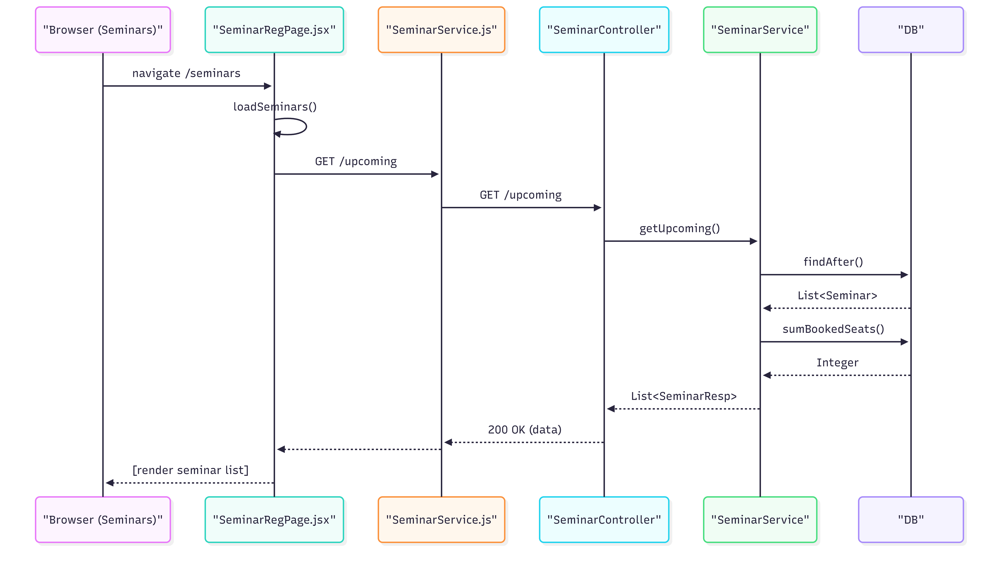

---

#### Validation

This function is a public, read-only operation. There are no specific validation rules applied. If the backend API call fails, the frontend displays an error message: *"Failed to load upcoming seminars."*

---

#### Data Dictionary

**Tables affected:** `seminar` (Read), `registration` (Read), `vehicle` (Read via JOIN)

**`seminar` — READ**

| Column | Operation | Purpose |
|---|---|---|
| `id` | Read | Unique identifier for the seminar. |
| `seminar_date` | Read | Used to filter for upcoming seminars and for sorting. |
| `max_seats` | Read | To determine the total capacity of the seminar. |
| `vehicle_id` | Read | To join with the `vehicle` table for model details. |

**`registration` — READ (Aggregate)**

| Column | Operation | Purpose |
|---|---|---|
| `seats_booked` | Read (SUM) | Aggregated to calculate the total number of confirmed bookings. |
| `status` | Read (Filter) | The aggregation is filtered to include only `SUCCESS` status records. |
| `seminar_id` | Read (Filter) | The aggregation is scoped to a specific seminar. |

**Response payload — `List<SeminarResponse>`**

Each item in the list is a [`SeminarResponse`](backend/src/main/java/com/sehs4701/backend/dto/response/SeminarResponse.java) object:

| Field | Type | Description |
|---|---|---|
| `id` | Long | The unique identifier of the seminar. |
| `vehicleId` | Long | The ID of the vehicle featured in the seminar. |
| `vehicleModelNumber` | String | The model number of the featured vehicle. |
| `vehicleDescription` | String | The description of the featured vehicle. |
| `seminarDate` | LocalDateTime | The scheduled date and time of the seminar. |
| `maxSeats` | int | The total seat capacity of the seminar. |
| `bookedSeats` | int | The number of seats taken by confirmed (`SUCCESS`) registrations. |
| `availableSeats` | int | The number of remaining seats (`maxSeats - bookedSeats`). |

**Entity Relationship (local):**

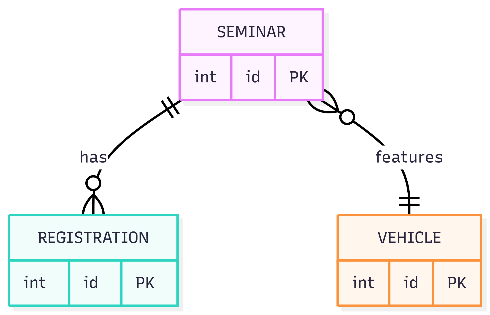

---

### 6.8 Seminar Registration (SF-008)

#### Description

SF-008 allows an authenticated and verified customer to register for an upcoming seminar. The customer selects a seminar and specifies the number of seats to book (1 or 2). The system then determines the registration status (`SUCCESS` or `WAIT`) based on real-time seat availability. To prevent race conditions during concurrent bookings, the system uses a pessimistic database lock on the seminar record during the registration process. An email notification is sent to the customer confirming the outcome.

- **Function ID:** SF-008
- **Endpoint:** `POST /api/seminars/{seminarId}/register`
- **Access:** Authenticated
- **Frontend Page:** [`SeminarRegistrationPage.jsx`](frontend/electric-vehicle-seminar-ui/src/pages/SeminarRegistrationPage.jsx) at route `/seminars`
- **Related Business Rules:** BR-014, BR-015, BR-016, BR-017, BR-018, BR-019, BR-020

---

#### Function Implementation

**Step-by-step process:**

1.  On the `/seminars` page, an authenticated customer selects a seminar from the list and chooses to book 1 or 2 seats.
2.  The customer clicks the "Confirm registration" button, which triggers the `handleSubmit()` function in [`SeminarRegistrationPage.jsx`](frontend/electric-vehicle-seminar-ui/src/pages/SeminarRegistrationPage.jsx).
3.  The frontend calls `seminarService.registerForSeminar()`, which makes a `POST` request to `/api/seminars/{seminarId}/register` with a payload containing the `seatsBooked` value.
4.  The backend's [`RegistrationController`](backend/src/main/java/com/sehs4701/backend/controller/RegistrationController.java) receives the request and delegates to [`RegistrationService.register()`](backend/src/main/java/com/sehs4701/backend/service/RegistrationService.java).
5.  The service begins a transaction and performs initial validation:
    -   Fetches the `Customer` and verifies that their email is confirmed (`isEmailVerified()`).
    -   Checks if the customer already has an active (`SUCCESS` or `WAIT`) registration for this seminar.
6.  The service acquires a pessimistic write lock on the target `Seminar` row using `seminarRepository.findByIdWithLock()` to ensure atomicity.
7.  It verifies that the seminar is not in the past.
8.  It calculates the `currentBookedSeats` by summing seats for all `SUCCESS` registrations for that seminar.
9.  The system determines the registration status:
    -   If `currentBookedSeats + seatsBooked <= seminar.max_seats`, the status is set to `SUCCESS`.
    -   Otherwise, the status is set to `WAIT`.
10. A new `Registration` entity is created with the customer, seminar, seats booked, and determined status. It is then saved to the database.
11. Based on the status, the [`EmailService`](backend/src/main/java/com/sehs4701/backend/service/EmailService.java) is called to send either a `SUCCESS` confirmation or a `WAIT` list notification email.
12. The new `Registration` is mapped to a [`RegistrationResponse`](backend/src/main/java/com/sehs4701/backend/dto/response/RegistrationResponse.java) and returned to the frontend.
13. The frontend displays a success message indicating either confirmation or waitlist placement and then redirects the user to their "My Registrations" page.

**Sequence:**

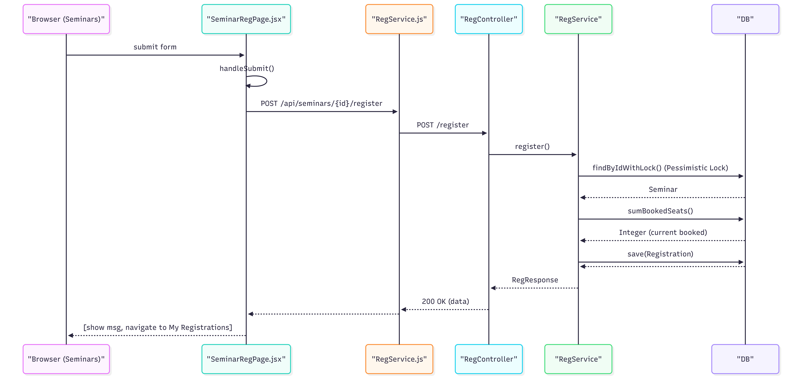

---

#### Validation

| Field / Rule | Rule | Error Message |
|---|---|---|
| `seatsBooked` | Must be 1 or 2. | *"Must book at least 1 seat"* / *"Maximum 2 seats per registration"* |
| Email Verification | Customer's email must be verified. | *"Email must be verified before registering for a seminar"* |
| Past Seminar | Cannot register for a seminar whose date has passed. | *"Cannot register for a past seminar"* |
| Duplicate Registration | Customer cannot have an existing active (`SUCCESS` or `WAIT`) registration for the same seminar. | *"You already have an active registration for this seminar"* |
| Seminar Existence | The `seminarId` must correspond to an existing seminar. | HTTP 404 with message: *"Seminar not found with id: {id}"* |

---

#### Data Dictionary

**Tables affected:** `registration` (INSERT), `customer` (Read), `seminar` (Read with Lock)

**`registration` — INSERT**

| Column | Operation | Value |
|---|---|---|
| `customer_id` | Write | FK to the authenticated `customer.id`. |
| `seminar_id` | Write | FK to the `seminar.id` from the URL path. |
| `seats_booked` | Write | Value from the `SeminarRegistrationRequest` (1 or 2). |
| `status` | Write | `SUCCESS` or `WAIT`, determined by seat availability logic. |
| `created_at` | Auto | Set by `@CreationTimestamp`. |
| `updated_at` | Auto | Set by `@UpdateTimestamp`. |

**Response payload — [`RegistrationResponse`](backend/src/main/java/com/sehs4701/backend/dto/response/RegistrationResponse.java)**

| Field | Type | Description |
|---|---|---|
| `id` | Long | The unique ID of the newly created registration. |
| `seminarId` | Long | The ID of the seminar that was booked. |
| `vehicleModelNumber` | String | The model number of the seminar's vehicle. |
| `seminarDate` | LocalDateTime | The date and time of the seminar. |
| `seatsBooked` | int | The number of seats that were booked. |
| `status` | Enum | The final status of the registration (`SUCCESS` or `WAIT`). |
| `createdAt` | LocalDateTime | The timestamp when the registration was created. |
| `updatedAt` | LocalDateTime | The timestamp when the registration was last updated. |

**Entity Relationship (local):**

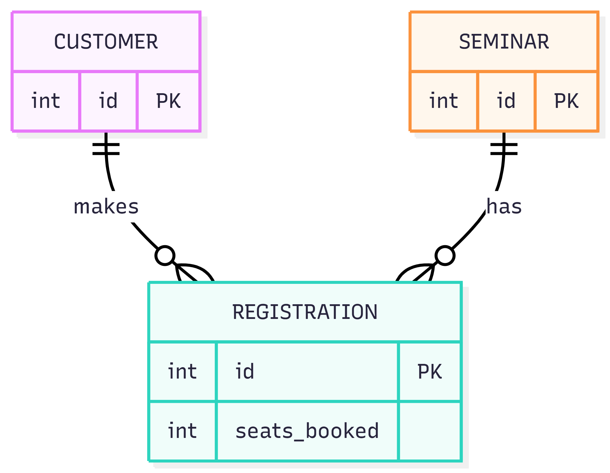

---

### 6.9 Waitlist Management (SF-009)

#### Description

SF-009 describes the automated process for managing a seminar's waitlist. This function is not triggered directly by a user endpoint but is an automated consequence of a `SUCCESS` registration being cancelled (SF-012). When a confirmed seat becomes available, the system processes the waitlist in a strict First-In, First-Out (FIFO) order, promoting the longest-waiting customer whose seat request fits the newly available capacity. Promoted customers are automatically notified via email.

- **Function ID:** SF-009
- **Endpoint:** None (Internal process triggered by `PUT /api/registrations/{id}/cancel`)
- **Access:** System-automated
- **Frontend Page:** None
- **Related Business Rules:** BR-021, BR-022, BR-023, BR-024, BR-025

---

#### Function Implementation

**Step-by-step process:**

1.  The waitlist promotion process is initiated exclusively within the `RegistrationService.cancel()` method, and only if the cancelled registration had a status of `SUCCESS`.
2.  After the `SUCCESS` registration is updated to `CANCEL`, the `promoteWaitlisted(seminar)` private method is called.
3.  The `promoteWaitlisted` method first re-calculates the number of available seats for the seminar by summing the seats of all remaining `SUCCESS` registrations and subtracting this from the `max_seats`.
4.  If `availableSeats <= 0`, the method returns immediately as there is no space to promote anyone.
5.  The method then fetches all registrations for the seminar that have a `WAIT` status, ordering them by their `created_at` timestamp in ascending order (FIFO). This is done via the `registrationRepository.findBySeminarIdAndStatusOrderByCreatedAtAsc()` query.
6.  The system iterates through the ordered waitlist.
7.  For each waitlisted registration (`waitReg`), it checks if the number of seats the user requested (`waitReg.getSeatsBooked()`) is less than or equal to the current `availableSeats`.
    -   **If it fits:** The registration's status is updated from `WAIT` to `SUCCESS` and saved to the database. The `availableSeats` count is decremented by the number of seats just filled. An email is sent to the promoted customer via `emailService.sendWaitlistPromotion()` to notify them of their new `SUCCESS` status.
    -   **If it does not fit:** The registration is skipped, and the loop continues to the next person on the waitlist to see if a smaller booking can be accommodated.
8.  The loop continues until either the waitlist is exhausted or the `availableSeats` count drops to zero.

**Sequence:**

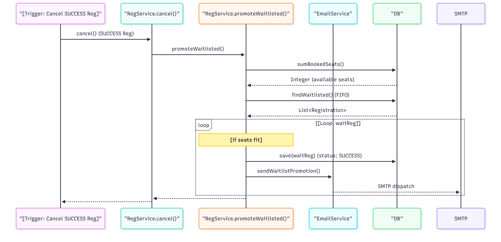

---

#### Validation

This is a backend-only, automated process with internal checks rather than user-facing validation.

- **Trigger Condition:** The process only runs if a `SUCCESS` registration is cancelled. Cancelling a `WAIT` or already `CANCEL` registration does not trigger promotion.
- **Seat Availability Check:** The core logic (`waitReg.getSeatsBooked() <= availableSeats`) ensures that the system never over-promotes and exceeds the seminar's `max_seats`.
- **FIFO Ordering:** The use of `OrderByCreatedAtAsc` on the waitlist query strictly enforces the first-in, first-out promotion rule.

---

#### Data Dictionary

**Tables affected:** `registration` (UPDATE), `customer` (Read), `seminar` (Read)

**`registration` — UPDATE**

| Column | Operation | Value |
|---|---|---|
| `status` | Write | Updated from `WAIT` to `SUCCESS` for promoted registrations. |
| `updated_at` | Auto | Automatically updated by `@UpdateTimestamp` on status change. |

**`registration` — READ**

| Column | Operation | Purpose |
|---|---|---|
| `status` | Read (Filter) | To find all `WAIT` registrations for the seminar. |
| `created_at` | Read (Sort) | To order the waitlisted registrations by FIFO. |
| `seats_booked` | Read | To check if a waitlisted booking fits the available seats. |

**Entity Relationship (local):** The process operates on existing `Registration` entities, updating their status based on the state of other registrations linked to the same `Seminar`.

### 6.10 Registration History (SF-010)

#### Description
SF-010 allows an authenticated customer to view a comprehensive history of their seminar registrations. The system retrieves all registrations (including `SUCCESS`, `WAIT`, and `CANCEL` statuses) associated with the customer where the corresponding seminar date falls within the past 12 months. The results are restricted strictly to the authenticated user's records and are presented in reverse chronological order (most recent first).

- **Function ID:** SF-010
- **Endpoint:** `GET /api/registrations/history`
- **Access:** Authenticated
- **Frontend Page:** `MyRegistrationsPage.jsx` at route `/my-registrations`
- **Related Business Rules:** BR-030, BR-031, BR-032, BR-034, BR-037

---

#### UI Wireframe


---

#### Function Implementation

**Step-by-step process:**
1. The authenticated customer navigates to the `/my-registrations` route.
2. The frontend component `MyRegistrationsPage.jsx` mounts and triggers a `useEffect` hook to fetch historical data.
3. The frontend issues a `GET /api/registrations/history` API call via the Axios client, automatically attaching the customer's JWT Bearer token in the `Authorization` header.
4. On the backend, the `JwtAuthenticationFilter` intercepts the request, validates the token (verifying non-expiration and correct signing signature), and populates the `SecurityContext` with the user's normalized email.
5. The `RegistrationController` receives the request and delegates the call to `RegistrationService.getRegistrationHistory()`.
6. The `RegistrationService` extracts the user's email from the `SecurityContext` and retrieves the `Customer` entity to enforce data scoping (BR-031).
7. The service layer executes a query against the `RegistrationRepository` to fetch records where `customer_id` matches the authenticated user AND `seminar.seminar_date` is strictly within the last 12 months, ordered by `seminar.seminar_date` descending (BR-030, BR-032).
8. The retrieved `Registration` entities, alongside their joined `Seminar` and `Vehicle` relational data, are mapped into a list of `RegistrationResponse` DTOs.
9. The backend returns the JSON array of DTOs with an HTTP `200 OK` status.
10. The frontend receives the payload, saves it to the component state, and renders the populated registration list interface.

**Sequence:**
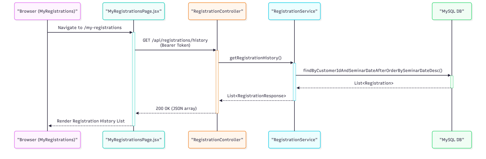

---

#### Validation

| Field | Rule | Error Message |
|---|---|---|
| Authentication | Request must include a valid, unexpired JWT in the `Authorization` header | HTTP 401: *"Unauthorized access"* |
| Customer Identity | The subject extracted from the JWT must resolve to an active customer record | HTTP 404: *"Resource not found"* |

*(Note: Since this is a parameterless `GET` endpoint resolving scope via the security context, field-level validation is limited to HTTP Authorization checks.)*

---

#### Data Dictionary

**Tables affected:** `registration` (Read), `seminar` (Read), `vehicle` (Read)

**`registration` — READ**

| Column | Operation | Purpose |
|---|---|---|
| `id` | Read | Unique identifier mapped to the response payload. |
| `customer_id` | Read (Filter) | Used to isolate records strictly to the authenticated customer. |
| `seminar_id` | Read (Join) | Used to fetch related seminar date and vehicle details. |
| `seats_booked` | Read | The quantity of reserved seats mapped to the response. |
| `status` | Read | The operational status (`SUCCESS`, `WAIT`, `CANCEL`) mapped to the response. |
| `created_at` | Read | Timestamp of booking creation mapped to the response. |
| `updated_at` | Read | Timestamp of last status modification mapped to the response. |

**`seminar` — READ**

| Column | Operation | Purpose |
|---|---|---|
| `seminar_date` | Read (Filter & Sort) | Used in the `WHERE` clause (date > now - 1 year) and the `ORDER BY DESC` clause. |
| `vehicle_id` | Read (Join) | Used to identify the associated electric vehicle for UI display. |

**`vehicle` — READ**

| Column | Operation | Purpose |
|---|---|---|
| `model_number` | Read | The display name / identifier of the vehicle mapped to `vehicleModelNumber` in the DTO. |

**Entity Relationship (local):**


### 6.11 Registration Detail View (SF-011)

#### Description
SF-011 allows an authenticated customer to view the detailed information of a specific seminar registration. The system retrieves the registration record, its associated seminar, and vehicle details based on the provided registration ID. Access is strictly scoped to the authenticated customer; attempting to access a registration belonging to another customer is rejected.

- **Function ID:** SF-011
- **Endpoint:** `GET /api/registrations/{id}`
- **Access:** Authenticated
- **Frontend Page:** `RegistrationDetailPage.jsx` at route `/my-registrations/:id`
- **Related Business Rules:** BR-033, BR-034, BR-037

---

#### UI Wireframe


---

#### Function Implementation

**Step-by-step process:**
1. The authenticated customer clicks on a registration record from their history list, navigating to the `/my-registrations/:id` route.
2. The frontend component `RegistrationDetailPage.jsx` mounts and triggers a `useEffect` hook, extracting the `id` parameter from the URL.
3. The frontend issues a `GET /api/registrations/{id}` API call via the Axios client, automatically attaching the customer's JWT Bearer token in the `Authorization` header.
4. On the backend, the `JwtAuthenticationFilter` intercepts the request, validates the token, and populates the `SecurityContext` with the user's normalized email.
5. The `RegistrationController` receives the request and delegates the call to `RegistrationService.getRegistrationById(id)`.
6. The `RegistrationService` queries the `RegistrationRepository` using the provided `id`.
   - **Registration not found** → throws `ResourceNotFoundException`: *"Registration not found with id: {id}"*.
7. The service extracts the user's email from the `SecurityContext`, retrieves the `Customer` entity, and verifies ownership by comparing the authenticated customer's ID with the `customer_id` of the retrieved registration (BR-033).
   - **Customer mismatch** → throws `UnauthorizedException`: *"You are not authorized to view this registration"*.
8. Upon successful validation, the `Registration` entity, alongside its joined `Seminar` and `Vehicle` relational data, is mapped into a `RegistrationResponse` DTO.
9. The backend returns the DTO as a JSON payload with an HTTP `200 OK` status.
10. The frontend receives the payload, saves it to the component state, and renders the registration details interface.

**Sequence:**
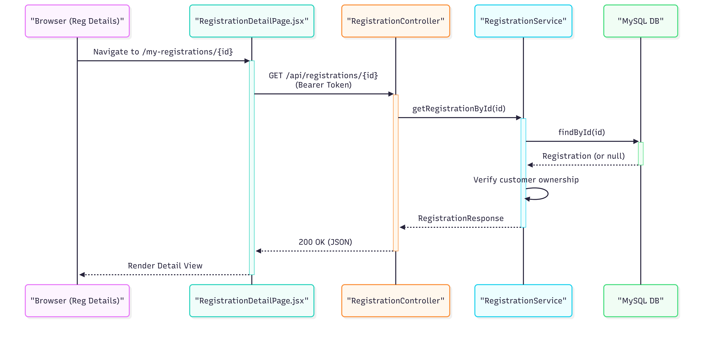

---

#### Validation

| Field | Rule | Error Message |
|---|---|---|
| Authentication | Request must include a valid, unexpired JWT in the `Authorization` header | HTTP 401: *"Unauthorized access"* |
| Registration ID | The `{id}` must correspond to an existing registration record | HTTP 404: *"Registration not found with id: {id}"* |
| Customer Match | The requested registration must belong to the authenticated customer | HTTP 401: *"You are not authorized to view this registration"* |

---

#### Data Dictionary

**Tables affected:** `registration` (Read), `seminar` (Read), `vehicle` (Read)

**`registration` — READ**

| Column | Operation | Purpose |
|---|---|---|
| `id` | Read (Filter) | Used in the `WHERE` clause to fetch the specific registration. |
| `customer_id` | Read | Used to verify ownership against the authenticated customer's ID. |
| `seminar_id` | Read (Join) | Used to fetch related seminar date and vehicle details. |
| `seats_booked` | Read | The quantity of reserved seats mapped to the response. |
| `status` | Read | The operational status (`SUCCESS`, `WAIT`, `CANCEL`) mapped to the response. |
| `created_at` | Read | Timestamp of booking creation mapped to the response. |
| `updated_at` | Read | Timestamp of last status modification mapped to the response. |

**`seminar` — READ**

| Column | Operation | Purpose |
|---|---|---|
| `seminar_date` | Read | The scheduled date of the seminar mapped to the response. |
| `vehicle_id` | Read (Join) | Used to identify the associated electric vehicle for UI display. |

**`vehicle` — READ**

| Column | Operation | Purpose |
|---|---|---|
| `model_number` | Read | The display name / identifier of the vehicle mapped to `vehicleModelNumber` in the DTO. |

**Entity Relationship (local):**


### 6.12 Registration Cancellation (SF-012)

#### Description
SF-012 allows an authenticated customer to cancel their active seminar registration. The cancellation must occur before the scheduled seminar date. Upon successful cancellation, the system updates the registration status to `CANCEL` and dispatches a cancellation acknowledgement email. Critically, if the cancelled registration held a `SUCCESS` status, the system automatically triggers the Waitlist Management process (SF-009) to promote the next eligible customer.

- **Function ID:** SF-012
- **Endpoint:** `PUT /api/registrations/{id}/cancel`
- **Access:** Authenticated
- **Frontend Page:** `RegistrationDetailPage.jsx` at route `/my-registrations/:id`
- **Related Business Rules:** BR-021, BR-022, BR-026, BR-027, BR-028, BR-029

---

#### UI Wireframe


---

#### Function Implementation

**Step-by-step process:**
1. The authenticated customer views an active registration on the `/my-registrations/:id` page and clicks the "Cancel Registration" button.
2. The frontend presents a confirmation modal to prevent accidental cancellations.
3. Upon user confirmation, the frontend calls `PUT /api/registrations/{id}/cancel` via the Axios client, attaching the JWT Bearer token.
4. The backend's `JwtAuthenticationFilter` authenticates the request and populates the `SecurityContext`.
5. The `RegistrationController` receives the request and delegates to `RegistrationService.cancel(id)`.
6. The `RegistrationService` retrieves the `Registration` record and validates the cancellation constraints:
   - **Customer mismatch:** The authenticated user's ID must match the registration's `customer_id` (BR-026). Otherwise, throws `UnauthorizedException`.
   - **Already cancelled:** If `status == CANCEL`, throws `BadRequestException`: *"Registration is already cancelled"* (BR-027).
   - **Past seminar:** If `seminar.seminar_date` is before `LocalDateTime.now()`, throws `BadRequestException`: *"Cannot cancel a registration after the seminar has started"* (BR-028).
7. The service stores the old status (`wasSuccess = (status == SUCCESS)`), updates the registration status to `CANCEL`, and saves it to the database.
8. The `EmailService` is invoked to dispatch a cancellation acknowledgement email to the customer (BR-029).
9. If the old status was `SUCCESS`, the service triggers the private `promoteWaitlisted(seminar)` method to evaluate and promote waitlisted users (BR-021, BR-022).
10. The backend maps the updated registration to a `RegistrationResponse` DTO and returns it with HTTP `200 OK`.
11. The frontend receives the updated status, dismisses the modal, updates the UI badge to `CANCEL`, and removes the cancel button.

**Sequence:**
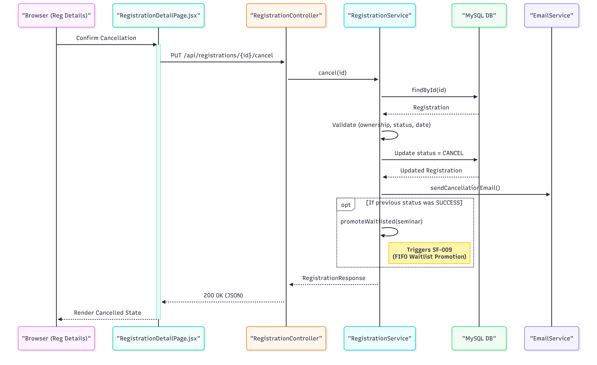

---

#### Validation

| Field | Rule | Error Message |
|---|---|---|
| Registration ID | The `{id}` must correspond to an existing registration record | HTTP 404: *"Registration not found with id: {id}"* |
| Customer Match | The registration must belong to the authenticated customer | HTTP 401: *"You are not authorized to cancel this registration"* |
| Status Check | The registration must not already be cancelled | HTTP 400: *"Registration is already cancelled"* |
| Seminar Date | The seminar date must be in the future | HTTP 400: *"Cannot cancel a registration after the seminar has started"* |

---

#### Data Dictionary

**Tables affected:** `registration` (Read/Update), `seminar` (Read)

**`registration` — UPDATE**

| Column | Operation | Purpose |
|---|---|---|
| `status` | Write | Updated to `CANCEL`. |
| `updated_at` | Auto | Automatically updated via `@UpdateTimestamp` to reflect the cancellation time. |

**`registration` — READ**

| Column | Operation | Purpose |
|---|---|---|
| `customer_id` | Read | Compared against authenticated user to ensure ownership. |
| `status` | Read | Checked to ensure the registration is not already cancelled. |

**`seminar` — READ**

| Column | Operation | Purpose |
|---|---|---|
| `seminar_date` | Read | Checked to ensure the seminar has not already started. |

**Entity Relationship (local):**


### 6.13 Email Notification Service (SF-013)

#### Description
SF-013 is an internal, backend-only utility service responsible for the dispatch of transactional emails. It handles various notification events triggered by other system functions, such as OTP verification codes (SF-001), successful registration confirmations (SF-002), seminar booking confirmations (SF-008), registration cancellations (SF-012), and waitlist promotions (SF-009). The service integrates with an external SMTP relay (e.g., Gmail) and logs all dispatch attempts to the `email_log` table for auditing purposes. 

- **Function ID:** SF-013
- **Endpoint:** Internal Service (No direct public API endpoint)
- **Access:** System-automated
- **Frontend Page:** None (Background process)
- **Related Business Rules:** BR-008, BR-012, BR-013, BR-025, BR-029

---

#### Function Implementation

**Step-by-step process:**
1. A core business service (e.g., `AuthService` or `RegistrationService`) invokes a specific notification method on the `EmailService` (e.g., `sendVerificationEmail()`, `sendWaitlistPromotion()`).
2. The `EmailService` constructs the email payload, embedding dynamic context (such as the 6-digit OTP code or the seminar's date and vehicle model) into predefined subject lines and text/HTML body templates.
3. The service attempts to send the email via Spring Boot's `JavaMailSender` interface, routing the payload through the configured external SMTP relay over a secure STARTTLS connection.
4. The outcome of the dispatch attempt is captured:
   - **Successful Dispatch:** The service creates an `EmailLog` entity with a `status` of `SENT` and records the exact `sent_at` timestamp.
   - **Failed Dispatch:** If a `MailException` occurs (e.g., due to network issues, rate limits, or invalid SMTP credentials), the exception is caught. The service creates an `EmailLog` entity with a `status` of `FAILED` and captures the exception details in the `error_message` field.
5. The `EmailLog` entity is persisted to the database via the `EmailLogRepository`.
6. Critically, to satisfy BR-013, email dispatch failures do not propagate exceptions back to the calling method. This ensures that transient email failures do not roll back primary database transactions (like creating a user account or cancelling a registration).

**Sequence:**
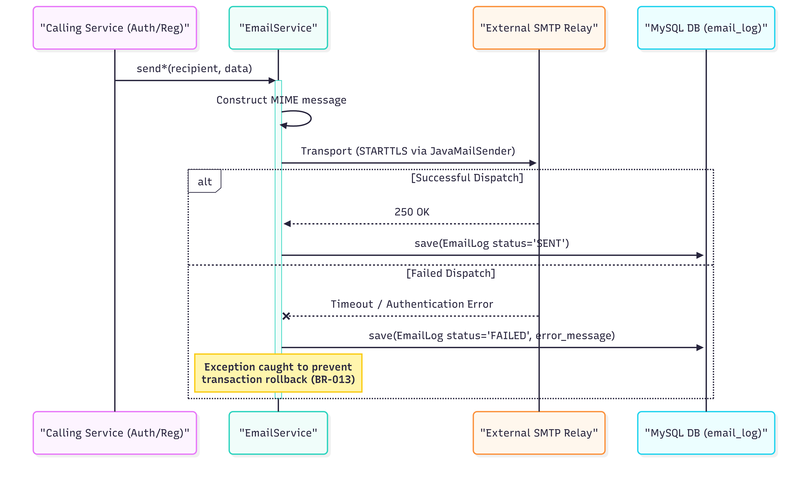

---

#### Validation

Because this is an internal component, it does not rely on HTTP request validation. However, the system enforces the following constraints during operation:

| Field / Component | Rule | Error Behavior |
|---|---|---|
| `recipient` | Must be a syntactically valid email address capable of being parsed by `InternetAddress` | Throws `MailParseException` internally → Logged as `FAILED` |
| SMTP Configuration | `MAIL_USERNAME` and `MAIL_PASSWORD` environment variables must be valid and authorized | Throws `MailAuthenticationException` internally → Logged as `FAILED` |

---

#### Data Dictionary

**Tables affected:** `email_log` (Insert)

**`email_log` — INSERT**

| Column | Operation | Purpose |
|---|---|---|
| `id` | Auto | Surrogate primary key. |
| `recipient` | Write | The target email address of the customer. |
| `email_type` | Write | A string classifying the nature of the email (e.g., `OTP_VERIFICATION`, `REGISTRATION_SUCCESS`, `WAITLIST_PROMOTION`, `CANCELLATION`). |
| `subject` | Write | The rendered subject line of the email. |
| `body` | Write | The full text/HTML content of the email message. |
| `status` | Write | The dispatch outcome: `SENT` or `FAILED`. |
| `error_message` | Write | Contains the exception message if `status` is `FAILED`; otherwise `null`. |
| `sent_at` | Write | Timestamp of successful dispatch (if `status` is `SENT`). |
| `created_at` | Auto | Timestamp of the log record creation, set via database defaults. |

**Entity Relationship (local):**
The `email_log` table acts as a standalone, append-only audit log. While its `recipient` column logically correlates with `customer.email`, there are no hard foreign key constraints linking it to other tables, allowing logs to persist even if a customer account is deleted.

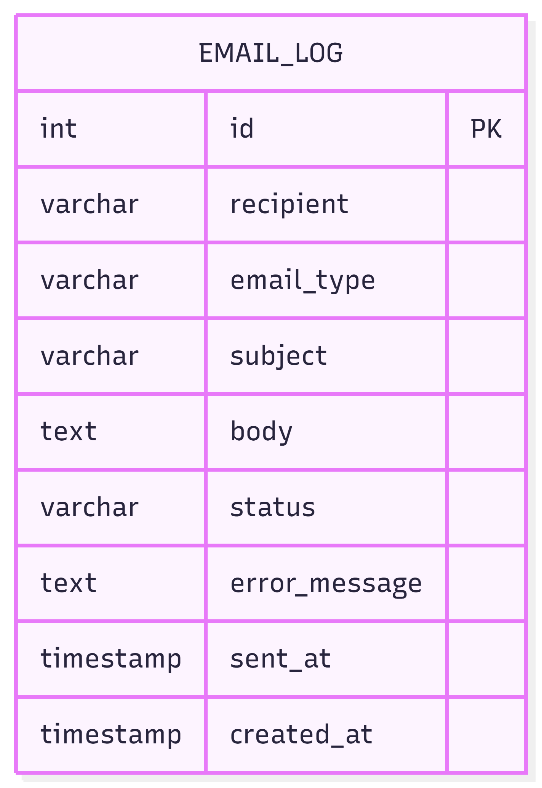

---

## 7. Test Specification

This section outlines the testing strategy and a summary of the test cases designed to ensure the system meets its functional and non-functional requirements.

### 7.1 Test Strategy

The testing strategy employs a multi-layered approach to validate the system's correctness, reliability, and performance.

-   **Unit Testing:** Focuses on individual components (e.g., services, repositories, utility classes) in isolation. JUnit 5 and Mockito are used to mock dependencies and verify the logic of each unit.
-   **Integration Testing:** Verifies the interaction between different components of the backend, such as the service layer, repository layer, and the database itself. These tests use a test-scoped database to ensure that data persistence and retrieval work as expected.
-   **System Testing:** Treats the entire system as a black box, testing end-to-end workflows through the API. These tests simulate real-world user scenarios, such as the full registration-to-cancellation flow.

### 7.2 Test Cases

A comprehensive set of test cases has been developed to cover all system functions. The detailed test plans can be found in the `docs/test-plans` directory.

#### 7.2.1 Unit Test Cases

-   **File:** [`docs/test-plans/unit_test_plan.csv`](docs/test-plans/unit_test_plan.csv)
-   **Summary:** These tests cover individual methods, such as JWT generation and validation, password encoding, DTO mapping, and exception handler logic.

#### 7.2.2 Integration Test Cases

-   **File:** [`docs/test-plans/integration_test_plan.csv`](docs/test-plans/integration_test_plan.csv)
-   **Summary:** These tests validate the collaboration between services and repositories, ensuring that database operations, email sending, and pessimistic locking for concurrent registrations function correctly.

#### 7.2.3 System Test Cases

-   **File:** [`docs/test-plans/system_test_plan.csv`](docs/test-plans/system_test_plan.csv)
-   **Summary:** These tests cover the complete user workflows, such as registering an account, booking a seminar, receiving a waitlist promotion, and viewing registration history.

#### 7.2.4 Smoke Test Cases

-   **File:** [`docs/test-plans/smoke_test_plan.csv`](docs/test-plans/smoke_test_plan.csv)
-   **Summary:** A subset of critical tests that are run to verify that the most important features of the system are working as expected.

### 7.3 Acceptance Criteria

For the system to be considered ready for release, the following criteria must be met:

-   All unit, integration, and system test cases must pass.
-   The system must correctly implement all business rules defined in Section 3.
-   The API must conform to the specification in `docs/api_documentation.md`.
-   The application must build and run successfully using the provided Docker Compose configuration.

---

## Appendix A: Glossary

| Term | Definition |
|---|---|
| **API** | Application Programming Interface. A set of rules and protocols for building and interacting with software applications. |
| **BCrypt** | A password-hashing function designed to be slow and computationally intensive to protect against brute-force attacks. |
| **CORS** | Cross-Origin Resource Sharing. A mechanism that allows resources to be requested from another domain. |
| **CRUD** | Create, Read, Update, and Delete. The four basic functions of persistent storage. |
| **Docker** | A set of platform as a service (PaaS) products that use OS-level virtualization to deliver software in packages called containers. |
| **DTO** | Data Transfer Object. An object that carries data between processes. |
| **FIFO** | First-In, First-Out. A method of processing and retrieving data in which the first item to be stored is the first one to be retrieved. |
| **Hibernate** | An object-relational mapping tool for the Java programming language. It provides a framework for mapping an object-oriented domain model to a relational database. |
| **J2EE** | Java 2 Platform, Enterprise Edition. A platform for developing and running distributed, multi-tier enterprise applications. |
| **JDBC** | Java Database Connectivity. An application programming interface (API) for the programming language Java, which defines how a client may access a database. |
| **JPA** | Jakarta Persistence API (formerly Java Persistence API). A Java specification for accessing, persisting, and managing data between Java objects/classes and a relational database. |
| **JWT** | JSON Web Token. A compact, URL-safe means of representing claims to be transferred between two parties. Used for authentication. |
| **Lombok** | A Java library that automatically plugs into your editor and build tools, and helps to reduce boilerplate code. |
| **Maven** | A build automation tool used primarily for Java projects. |
| **Nginx** | A web server that can also be used as a reverse proxy, load balancer, mail proxy and HTTP cache. |
| **OTP** | One-Time Password. A password that is valid for only one login session or transaction. |
| **REST** | Representational State Transfer. An architectural style for designing networked applications. |
| **SMTP** | Simple Mail Transfer Protocol. A communication protocol for electronic mail transmission. |
| **SPA** | Single-Page Application. A web application that interacts with the user by dynamically rewriting the current web page with new data from the web server, instead of the default method of a web browser loading entire new pages. |
| **Vite** | A build tool that aims to provide a faster and leaner development experience for modern web projects. |

---
