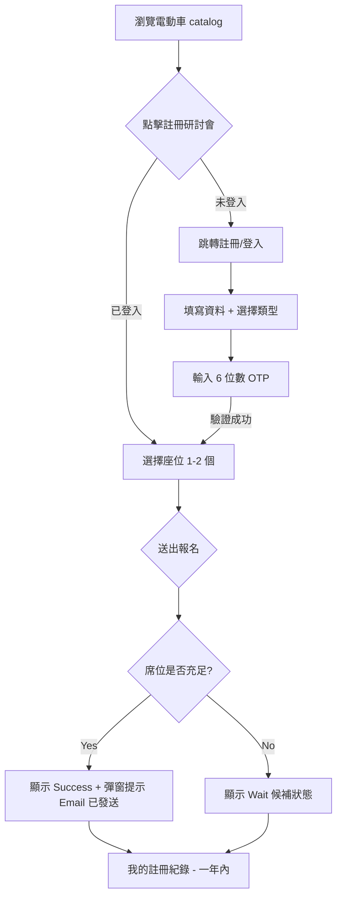

# `frontend-action-plan.md`

本文件為「線上電動車研討會註冊系統」之前端開發計畫書，由資深前端工程師擬定。本計畫嚴格遵循 `specs/SEHS4701_Project_Requirements.md` 中定義之業務規則（Business Rules），旨在確保前端實作與後端 J2EE 系統完美對接。

---

## 1. 前後端專案結構整合 (Frontend-Backend Integration)
**目標：** 建立穩定且可擴展的開發環境，確保 API 通訊順暢。

- [ ] **[P0] API 基底路徑與 Axios 配置**
  - 建立 `src/api/axiosConfig.js`，根據 `process.env.NODE_ENV` 動態切換本地開發（Local）與生產環境（Production）的 API URL。
  - 配置全局攔截器（Interceptors），統一處理 401（未授權）與 500（伺服器錯誤）狀態碼。
- [ ] **[P0] 分支管理與合併策略**
  - 確保前端 `main` 分支與後端分支同步，定義統一的數據結構（DTO）格式。
  - 建立環境變數範本 `.env.example`。
- [ ] **[P1] 共通組件封裝**
  - 重構 `src/components/ui/` 下的 `Button`, `Input`, `Modal` 以符合專案設計風格，減少重複代碼。

---

## 2. 電動車特色說明 (Electric Vehicle Feature Description) 頁面
**目標：** 精準展示至少 5 款電動車，並串接對應的研討會資訊。

- [ ] **[P0] 定義車輛數據結構 (Alignment with PDF)**
  - UI 需包含以下欄位：型號 (`Model Number`)、描述 (`Description`)、圖片 (`Picture`)、功能特色 (`Feature Functions`)、單價 (`Unit Price`)。
  - 實作 `EVCatalogPage.jsx` 的數據獲取邏輯，確保從 `/api/evs` 讀取動態數據而非寫死 (Mock)。
- [ ] **[P1] 研討會日期與席位展示**
  - 在車輛詳情中加入「研討會日期 (`Seminar Dates`)」與「最大席位數 (`Maximum Number of Seats`)」。
  - 根據剩餘席位顯示不同的 UI 視覺提醒（如：名額將滿）。
- [ ] **[P2] 圖片加載優化**
  - 實作圖片懶加載 (Lazy Loading) 與佔位符 (Placeholder)，提升使用者體驗。

---

## 3. 電動車研討會註冊 (Seminar Registration) 頁面
**目標：** 實作具備席位限制與自動候補機制的註冊流程。

- [ ] **[P0] 註冊表單席位限制 (Business Rule)**
  - 限制用戶每筆註冊僅能選擇 1 至 2 個座位（需在前端 `Select` 或 `Input` 進行驗證）。
  - 檢查用戶登入狀態，未登入者導向登入頁。
- [ ] **[P0] 註冊狀態即時顯示**
  - 處理 API 回傳之三種狀態：成功 (`Success`)、取消 (`Cancel`)、候補 (`Wait`)。
  - 若註冊後進入候補名單，UI 需明確標示「候補中 (`Waitlist`)」。
- [ ] **[P1] 歷史紀錄查詢 (Online Enquiry)**
  - 實作歷史紀錄分頁，並加入日期過濾器，嚴格限制僅能查詢「一年內 (`Past Year`)」的研討會紀錄。
  - 提供詳細資訊彈窗 (Modal)，展示註冊時間、地點與席位資訊。

---

## 4. OTP 驗證流程與會員註冊
**目標：** 實作安全的雙重身分認證（Email + OTP）註冊流程。

- [ ] **[P0] 會員類型與資訊收集**
  - 註冊表單需包含：姓名 (`Name`)、電話 (`Telephone`)、Email (`Email`)。
  - 用戶類型選擇：公司 (`Company`) 或 個人 (`Personal`)。
- [ ] **[P0] 6 位數 OTP 驗證 UI**
  - 實作 `VerificationPage.jsx` 的六格輸入組件，支援自動跳格與退格處理。
  - **倒數計時器 (Countdown Mechanism)：** 實作 60-120 秒重新發送 OTP 的倒數功能，防止過度調用接口。
- [ ] **[P1] Email 作為登入帳號規則**
  - 驗證表單提交後，前端需確保 Email 格式正確，並提示此 Email 將作為系統唯一登入 ID。

---

## 5. Email 確認機制的 UI 回饋 (Email Acknowledgement UI)
**目標：** 強化系統回饋，確保用戶知曉郵件通知狀態。

- [ ] **[P0] 全局通知系統 (Toast/Modal Feedback)**
  - 當用戶完成以下動作時，顯示 UI 提示：
    - 會員註冊成功。
    - 研討會報名成功。
    - 研討會報名取消。
    - 候補狀態轉正 (Wait -> Success)。
- [ ] **[P1] 串接觸發 Email 發送 API**
  - 雖然 Email 由後端發送，但前端在接收到 API 成功響應後，需提示用戶「已發送確認郵件至您的信箱」。
- [ ] **[P2] 自動跳轉邏輯**
  - 註冊成功後，顯示 3 秒 Toast 後自動跳轉至儀表板 (Dashboard) 或登入頁。

---

## Mermaid 系統工作流 (Frontend Registration Flow)

